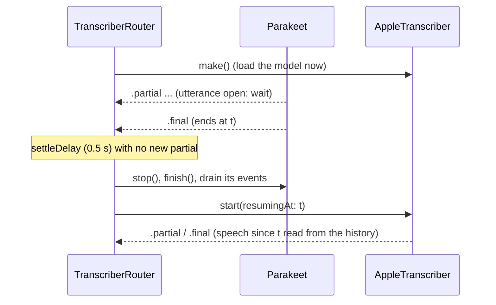

# Apple speech fallback and engine routing

Blau transcribes the user with Parakeet ([asr.md](asr.md)). When Parakeet
can't run, Apple's on-device `SpeechAnalyzer` with a `SpeechTranscriber`
module takes over (#31). `TranscriberRouter` picks the engine and switches
between them mid-conversation, at the end of an utterance, so no words are
lost or repeated.

| Type | Module | What it does |
| --- | --- | --- |
| `AppleTranscriber` | BlauTranscription | A `Transcriber` over a `SpeechAnalyzerEngine`: partials and one final `Utterance` per thing said, like `ParakeetStreamingTranscriber` |
| `SpeechAnalyzerEngine` | BlauTranscription | The seam: start a session, feed 16 kHz frames, request finalization, results out |
| `SystemSpeechAnalyzerEngine` | BlauTranscription | The real engine: `SpeechAnalyzer` + `SpeechTranscriber` (+ `SpeechDetector`) |
| `AppleSpeechAssets` | BlauTranscription | `AssetInventory`: is the language supported and installed; reserve and install it |
| `TranscriberRouter` | BlauTranscription | Runs Parakeet or Apple's engine, switches at utterance boundaries |
| `TranscriberRoutingPolicy` | BlauTranscription | The engine choice as a pure function |
| `TranscriptionSettings` | BlauTranscription | Settings → Speech Recognition: the "Use Apple Speech Recognition" toggle |
| `RecognitionVocabularySource` | BlauCore | Names to bias recognition toward |
| `MemoryEntityVocabulary` | BlauPersistence | The vocabulary from memory's people, companies, products and projects |

```swift
let monitor = environment.backgroundInference                     // BackgroundInferenceMonitor (#26)
let router = TranscriberRouter(
    parakeet: .parakeet(models: modelManager, audio: capture.hub, voiceActivity: vad,
                        inferenceObserver: monitor),
    apple: .apple(audio: capture.hub, voiceActivity: vad,
                  vocabulary: MemoryEntityVocabulary { await persistence.stack?.container }),
    preference: environment.transcriptionSettings.enginePreference)
router.followPreferences(environment.transcriptionSettings.preferenceChanges())  // the Settings toggle
router.followMemoryPressure(MemoryPressureMonitor.levels())
await monitor.register(router, budget: .milliseconds(320))       // the "asr" stage
let transcriber = SecondPassTranscriber(wrapping: router, ...)   // #30, refines either engine's finals
try await transcriber.start()
for await event in transcriber.events { ... }   // .partial / .final / .refined, whichever engine runs
```

In the app, `LiveVoicePipeline.start` (`Blau/VoiceLoop/VoiceLoop.swift`)
builds the router for each conversation with
`TranscriberRouter.conversation(parakeet:apple:settings:memoryPressure:backgroundInference:)`,
which does the three steps above: it starts on
`transcriptionSettings.effectiveEnginePreference`, follows
`preferenceChanges()` and `MemoryPressureMonitor.levels()`, and registers the
router as the monitor's `"asr"` stage (unregistered when the conversation
stops). So turning "Use Apple Speech Recognition" on mid-conversation
switches engines at the next utterance boundary. Parakeet is preloaded
alongside the audio when it is the engine to start on, and a missing
Parakeet model no longer blocks a conversation: Apple's engine stands in
(only Silero is required, for barge-in and voice ID). Not wired yet: the
second pass around the router, memory's vocabulary for Apple's engine, and
scene phase changes reaching the running engine (the router is an
`AppLifecycleParticipant`, but the transcriber slot is still
`UnavailableService`).

## Verified against the SDK

Every Speech API used here was checked in the iOS 27.2 and macOS 27.2 SDK
`Speech.swiftinterface` (Xcode 27.2) and exercised on this Mac
(`AppleSpeechLiveTests`). All of it is `@available(anyAppleOS 26, *)`, so no
`#available` checks are needed at Blau's iOS 26.0 deployment target.

- `SpeechAnalyzer(modules:options:)`, `prepareToAnalyze(in:)`,
  `start(inputSequence:)` with an `AsyncStream<AnalyzerInput>`,
  `finalize(through:)`, `finalizeAndFinishThroughEndOfInput()`,
  `cancelAndFinishNow()`, `setContext(_:)`,
  `bestAvailableAudioFormat(compatibleWith:)` (16 kHz mono `Int16` here).
- `SpeechTranscriber(locale:preset:)`, `supportedLocale(equivalentTo:)`,
  `installedLocales`, `isAvailable`, `results` (`isFinal`, `range`,
  `resultsFinalizationTime`, `text` with the `audioTimeRange` attribute).
- `SpeechDetector(detectionOptions:reportResults:)`.
- `AssetInventory.status(forModules:)`, `reserve(locale:)`,
  `reservedLocales`, `assetInstallationRequest(supporting:)` and
  `AssetInstallationRequest.downloadAndInstall()`.
- `AnalysisContext.contextualStrings[.general]`.
- `AnalyzerInput(buffer:bufferStartTime:)`: each frame is stamped with its
  capture-stream position, so result times are on the pipeline's timeline
  (checked with a stream starting at 100 s), and a session can start
  anywhere in the stream.

### Where the implementation differs from the issue

- **Preset.** The issue named `.progressiveTranscription`.
  `AppleTranscriber` uses `.timeIndexedProgressiveTranscription`: the same
  reporting (`volatileResults` + `fastResults`) plus the `audioTimeRange`
  attribute, which gives every finalized word a time. The word times are
  what let the transcriber find pauses, split a result that spans one, and
  keep words an earlier utterance committed out of the next.
- **`SpeechDetector` gates, it doesn't segment.** On this Mac a
  `SpeechDetector` with `reportResults: true` delivered no results at all,
  so segmentation can't depend on it. It stays in the modules (with
  `reportResults: false`) so silence isn't transcribed, and segmentation
  comes from the transcriber's word times and, when its model is
  installed, Blau's Silero VAD.
- **`finalize(through:)` is never awaited from the audio path.** It returns
  only once the audio after the position has been analyzed; awaiting it
  from the code that feeds the audio deadlocks (it hung for over a minute
  in the probe). `SystemSpeechAnalyzerEngine.requestFinalization` runs it in
  a task of its own.
- **Forced finalization is a last resort.** In the probe, calling
  `finalize(through:)` mid-stream garbled the short sentence that followed
  ("Yes." came out as "." or "to...."), twice in a row. The transcriber
  lets the system finalize by itself (0.7–2 s after a sentence) and only
  asks after the pending words have been unchanged for 1.5 s.

## How `AppleTranscriber` builds utterances

The system transcriber's volatile results are its current guess for the
audio after the last final; a final result settles a sentence, with word
times. An utterance is the run of finalized sentences up to a pause. It is
committed when:

| Rule | Default | What commits |
| --- | --- | --- |
| No VAD: the last finalized word ended `silenceCommitDelay` ago and no newer words are pending | 0.9 s (the Parakeet transcriber's) | The finalized sentences |
| VAD: it confirmed a pause (speech ended and didn't resume for `silenceCommitDelay`) and the engine has finalized up to it (within 400 ms) | 0.9 s | The sentences before the pause; words after where speech resumed (split halfway through the pause) start the next utterance |
| Pending words unchanged for `finalizationRequestDelay` | 1.5 s | The engine is asked to finalize them, then the rules above apply |
| Still unfinalized `finalizationTimeout` after asking | 1.5 s | Everything, the unfinalized words as they are |
| `maximumUtteranceDuration` | 30 s | The finalized sentences; the pending words start the next utterance |
| The capture stream ends, `stop()`, or the session fails | | Everything |

Without VAD, the system's own finalization sets the utterance boundary: a
final that arrives after the next sentence has started still ends its
utterance, because the next sentence's words haven't been reported yet.
With VAD, the pause on the audio timeline decides, as for Parakeet: two
sentences with a 0.7 s pause are one utterance, a 1.6 s pause splits them
even when the system finalizes both together.

Results for audio already committed are dropped (`staleResultsDropped`):
a late final keeps only its words after the commit, and a volatile guess
that still reaches back before it is ignored until the next one.

Final utterances carry `speaker: .user`, `speakerDecision: nil` (the voice
ID gate decides) and the time range of the speech: from VAD's onset (or
the first word) to VAD's end of speech (or the last word).

### Restarting and resuming

- Each `start()` opens a new analyzer session; the model stays loaded
  between sessions (`modelRetention: .lingering`).
- If the results stream fails, what was said is committed
  (`recognizerFailure`) and the session restarts on the next frame, up to
  three times in a row.
- `start(resumingAt:)` asks the capture hub for up to 10 s of history and
  feeds only the audio from the position on. Speech VAD already reports
  as under way starts its utterance at the position.

## `TranscriberRouter`

`TranscriberRoutingPolicy.choose(_:)`, in order:

1. **Settings toggle on** → Apple (`userPreference`).
2. **Parakeet not available** (model not installed, or it failed to load
   or start) → Apple (`primaryUnavailable`).
3. **`BackgroundInferenceMonitor` moved speech-to-text to `systemSpeech`**
   → Apple (`background`). See below.
4. **Critical memory pressure** → Apple (`memoryPressure`): its model runs
   in a system process, not in Blau's. Switching away from Parakeet frees
   its Core ML models: the router drops the transcriber, and
   `ParakeetStreamingTranscriber.finish()` unloads the recognizer it owns
   (`StreamingSpeechRecognizer.unload()`; `ParakeetStreamingTranscriber.load`
   sets `unloadsRecognizerOnFinish`). A recognizer the caller passes in,
   such as the one the ASR evaluation engine and the soak run share across
   fixtures, stays loaded. The performance HUD reaches
   Parakeet's chunk counters through `ParakeetHandoff`, which holds the
   transcriber weakly so it doesn't keep the model alive.
5. Otherwise Parakeet (`primary`).

When the chosen engine isn't available the other runs (`fallback`), and
with neither available `start()` throws `noEngineAvailable`. Availability is
asked before each decision: Parakeet's model directory
(`ModelManager.directory(for: .parakeetRealtimeEOU)`), and
`AppleSpeechAssets.availability()` for Apple (device and language
supported; a missing model downloads when the engine is built). Call
`availabilityDidChange()` when a model finishes downloading or is deleted.

### Switching mid-conversation



1. The new engine is built right away, while the old one keeps running.
2. The switch waits until the old engine has no utterance open: its last
   event was a final, and `settleDelay` (0.5 s) passed without a new
   partial, so speech that carries straight on isn't cut.
3. The old engine is stopped and finished, and every event it emits on the
   way out is forwarded before the new one starts.
4. The new engine starts at the end of the last committed utterance and
   reads the audio since then from the 30 s capture history.
5. With no boundary within `maximumSwitchDelay` (20 s, a long monologue),
   the switch is forced: the old engine's `stop()` commits what was said,
   and the new one resumes after it.

An engine switched away from is finished and released (freeing Parakeet's
memory); switching back builds a new one. If the new engine fails to build,
the old one keeps running and the failed engine is skipped until
`availabilityDidChange()`. If it fails to start, the router starts the
best remaining engine at the same position.

### Background entry (#26)

The router is the speech-to-text stage (`"asr"`) of the
`BackgroundInferenceMonitor` that #26 built, which decides where each model
stage runs off screen ([background.md](background.md)):

- It conforms to `InferenceBackendSwitchable` with the backends
  `[neuralEngine, systemSpeech]`: Parakeet, then Apple's engine. (Parakeet
  on the CPU belongs between them once `ParakeetEouRecognizer` can load
  with `.cpuOnly`.) `inferenceBackend` is `systemSpeech` whenever Apple's
  engine runs.
- `switchInferenceBackend(to: .systemSpeech)` hands the conversation to
  Apple's engine at the next utterance boundary and returns once it runs
  (at most `maximumSwitchDelay` later); `.neuralEngine` hands it back.
  When Apple's engine can't run it throws, so the monitor marks the backend
  unusable and Parakeet keeps going. Going back to `neuralEngine` while the
  user chose Apple's engine leaves Apple's engine running.
- `ParakeetStreamingTranscriber` reports every model chunk (its time, or
  the error) to the monitor as the `"asr"` stage (`inferenceObserver`), so
  off screen the monitor moves the stage to `systemSpeech` when Parakeet
  throws twice in a row or its p95 goes over 80% of the 320 ms hop, and
  back when Blau returns to the screen.

The background probe's verdict is still pending on an iPhone
([benchmarks.md](benchmarks.md#background-neural-engine-behaviour)), so
the shipping mitigation (`BackgroundInferenceMitigation.shipping`) is
`keepNeuralEngine`: entering the background switches nothing, and only the
runtime escalation above moves speech-to-text to Apple's engine. If the
probe recommends `switchToSystemTranscriber`, changing `shipping` makes
every trip off screen start on Apple's engine, through the same path.

## Settings → Speech Recognition

**Use Apple Speech Recognition** forces Apple's engine
(`TranscriptionSettings.forcesAppleEngine`, saved per device in
`UserDefaults` under `blau.transcription.engine`). The section says when
Apple's recognizer doesn't support the device or the language (the toggle
is then disabled), or when its model will download first. A running router
following `preferenceChanges()` switches at the next utterance boundary.

## Vocabulary

`AppleTranscriber` reads a `RecognitionVocabularySource` at every `start()`
(and on `refreshVocabulary()`) and passes it as
`AnalysisContext.contextualStrings[.general]`. `MemoryEntityVocabulary`
supplies memory's entity names and aliases: people, organizations,
products and projects first, then places and events, then the rest, most
recently updated first, at most 100, deduplicated ignoring case and
diacritics. Parakeet has no vocabulary input.

## Telemetry

| What | Where |
| --- | --- |
| `asr.eou` interval | From when the speaker seems to have stopped to the commit; ends with the reason (`silence`, `maximumLength`, ...) or `resumed` |
| `asr.engineSwitch` event | Each completed switch (`Signposts.asr`) |
| `inference.backendSwitch` interval | The monitor's switches of the `"asr"` stage (#26) |
| Engine changes, switches, failures | `Log.asr` notice / error |
| Utterance committed | `Log.asr` info, the text as `.private` |
| `AppleTranscriber.statistics` | Utterances and commits by reason, partials, volatile and final results, stale results dropped, finalization requests, unfinalized commits, sessions, failures, end-of-speech delay |
| `TranscriberRouter.status` / `.statistics` | The running engine and why, a pending switch; switches by reason, forced switches, failed activations |

## Results on this Mac

`AppleSpeechLiveTests` (`BLAU_APPLE_ASR_LIVE=1`): the VAD fixtures through
the real `SpeechTranscriber` (en_US, already installed on this Mac), with
and without Silero's recorded VAD events. Recorded 2026-10-07 on an Apple
M3 Max, macOS 27.2, debug build, the audio played in real time (a run at
4× gave the same text and delays within 0.2 s). WER is over the whole
fixture (the reference includes the "Fred" sentence Parakeet can't
decode); the delay is from the labelled end of each sentence to its final,
in audio time (finals the end of the fixture committed are left out).

| Fixture | WER, no VAD | WER, VAD | Final after the end of speech |
| --- | --- | --- | --- |
| `conversation-quiet` | 0.15 | 0.15 | 0.4–2.0 s |
| `conversation-noisy` (18 dB SNR) | 0.23 (0.04 in another run) | 0.27 | 1.5–3.1 s |
| `monologue-long` | 0.04 | 0.04 | (one sentence, committed at the end of the fixture) |
| `pauses` | 0.00 | 0.00 | 1.8 s (no VAD; with VAD the 0.7 s pause keeps both sentences in one utterance) |

- The system transcriber finalizes a sentence 0.7–2 s after it ends, so
  Apple's finals come about a second later than Parakeet's (0.9–1.1 s,
  [asr.md](asr.md#results)). That is the fallback's cost.
- Recognition varies between runs of the same audio: the noisy fixture's
  third sentence came out as ", to, then." in some runs and as "should we
  move the hike to Sunday then" in others.
- Apple's engine recognizes the "Fred" formant-synthesizer sentence that
  Parakeet decodes nothing from (as "Then we'll just go to the venue
  tomorrow", or "Then tomorrow morning").

## Tests

| Where | What | Runs |
| --- | --- | --- |
| `Tests/BlauTranscriptionTests/Apple/AppleTranscriberTests.swift` | Every commit rule on a scripted engine: pauses, sentences across a short pause, finalization request and timeout, stale results, maximum length, VAD pauses and splitting, `start`/`stop`/stream end, resume, session failure and restart, vocabulary, timestamps | `swift test` |
| `Tests/BlauTranscriptionTests/Apple/SystemSpeechEngineTests.swift` | Audio conversion to the analyzer's format, the analyzer timeline | `swift test` |
| `Tests/BlauTranscriptionTests/Routing/TranscriberRouterTests.swift` | The policy table, switching at a boundary, the settle delay, forced switches, the background monitor driving the router (with the real `BackgroundInferenceMonitor`), memory pressure, model availability, build and start failures, the Settings model | `swift test` |
| `Tests/BlauTranscriptionTests/Routing/ParakeetHandoffTests.swift` | Switching to Apple's engine frees Parakeet: its recognizer is unloaded, and the HUD's handoff (weak) and preload (until taken) don't keep it alive | `swift test` |
| `Tests/BlauTranscriptionTests/ASR/ParakeetResumeTests.swift` | Parakeet taking over at a resume position | `swift test` |
| `Tests/BlauTranscriptionTests/ASR/ParakeetInferenceObserverTests.swift` | Parakeet reporting its chunks to the monitor | `swift test` |
| `Tests/BlauPersistenceTests/MemoryEntityVocabularyTests.swift` | The vocabulary from memory | `swift test` |
| `Tests/BlauTranscriptionTests/Apple/AppleSpeechLiveTests.swift` | The fixtures through the real `SpeechTranscriber` | `BLAU_APPLE_ASR_LIVE=1` |
| `BlauTests/SpeechRecognitionSettingsAppTests.swift` | The settings in the app environment | `make test-unit` |
| `BlauUITests/SpeechRecognitionSettingsUITests.swift` | The toggle is shown and persists across launches | `make test-ui` |

```sh
cd Packages/BlauKit
BLAU_APPLE_ASR_LIVE=1 swift test --filter AppleSpeechLiveTests                       # real time
BLAU_APPLE_ASR_LIVE=1 BLAU_APPLE_ASR_PACE=4 swift test --filter AppleSpeechLiveTests  # 4x
```

## On a device

These need a physical iPhone and are recorded here when run.

| Check | How | Result |
| --- | --- | --- |
| Apple's engine on iOS 26.0 | Toggle on, talk: partials and finals appear; check `SpeechDetector` is accepted as a module on 26.0 | Pending |
| Switch on background entry | Only if the background probe recommends `switchToSystemTranscriber` (or Parakeet can't keep up locked): lock the phone mid-conversation; the next utterance comes from Apple's engine (`Log.asr` "switched parakeet → apple (background)"), nothing lost or repeated across the switch, and back after unlocking | Pending (probe pending) |
| Toggle mid-conversation | Turn the toggle on while talking: the current sentence finishes on Parakeet, the next is Apple's | Pending |
| Model download on first use | A device without the language's model: the first switch downloads it (`AssetInventory`) | Pending |
| Final latency | `asr.eou` intervals with the Blau Instruments template, both engines | Pending |
