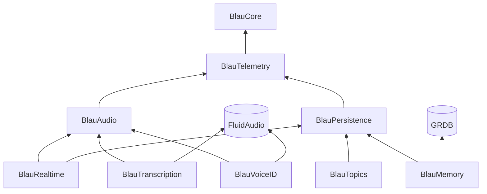

# Architecture

Blau is split into a thin app target and a local Swift package, **BlauKit**,
that holds the business logic. The full architecture, pipeline and research
notes live in issue #1. This document covers the code layout and the rules
for module dependencies.

## Layout

| Path               | Contents                                                                  |
| ------------------ | ------------------------------------------------------------------------- |
| `Blau/`            | App target: SwiftUI views and the composition root that wires modules together ([app-shell.md](app-shell.md)) |
| `Packages/BlauKit` | Local Swift package, one library per subsystem, each with a Swift Testing target |

The app links every BlauKit library (see `packages:` and the `Blau` target's
`dependencies:` in `project.yml`). `Blau/BlauKitModules.swift` lists the
modules, and `BlauTests/BlauKitLinkageTests.swift` checks that the list is
complete.

## Modules

| Layer | Module              | Owns                                                                                          |
| ----- | ------------------- | --------------------------------------------------------------------------------------------- |
| 0     | `BlauCore`          | Shared value types (`Utterance`, `Speaker`, `SpeakerDecision`, `AudioFrame`, `TimeRange`, `ConversationID`, `SpeechSegment`), the service protocols and their fakes, protocols shared across siblings (`TextEmbedder`, `TextGenerator`, `VoiceActivitySource`, `RecognitionVocabularySource`), feature flags, the app lifecycle, the `BlauClock` abstraction, run-time configuration overrides |
| 1     | `BlauTelemetry`     | Logger categories, `OSSignposter` intervals, MetricKit, the performance HUD model             |
| 2     | `BlauAudio`         | `AVAudioSession` / `AVAudioEngine`, 16 kHz capture and fan-out, 24 kHz playback, resampling   |
| 2     | `BlauPersistence`   | SwiftData schemas (CloudKit compatible, see [data-model.md](data-model.md)), migrations, iCloud sync and history ([sync.md](sync.md)), `ModelActor` writes |
| 3     | `BlauTranscription` | Silero VAD ([vad.md](vad.md)), streaming Parakeet ASR ([asr.md](asr.md)), second pass, `SpeechAnalyzer` fallback and engine routing ([apple-asr.md](apple-asr.md)), model downloads |
| 3     | `BlauVoiceID`       | Speaker embeddings, enrollment, accept / reject / uncertain gate, language ID                 |
| 4     | `BlauRealtime`      | xAI realtime WebSocket client, typed events, token minting, session orchestration, tools      |
| 4     | `BlauTopics`        | Streaming topic segmentation ([topics.md](topics.md)), boundary confirmation, labeling        |
| 4     | `BlauMemory`        | The shared text embedding service ([embeddings.md](embeddings.md)), the FTS5 + vector search index ([memory-index.md](memory-index.md)), hybrid retrieval, fact extraction, memory tools |

Each module exports a `<Module>Module` marker type conforming to
`BlauCore.BlauModule`, with its name and a one-line summary.

## Dependency graph

Arrows point from a module to what it imports. These are the edges declared in
`Packages/BlauKit/Package.swift` today. `BlauCore` and `BlauTelemetry` are
imported by every module above them; those edges are drawn once per layer to
keep the diagram readable.

The complete list of declared edges:

| Module              | Imports                                     | Third party  |
| ------------------- | ------------------------------------------- | ------------ |
| `BlauCore`          | none                                        |              |
| `BlauTelemetry`     | `BlauCore`                                  |              |
| `BlauAudio`         | `BlauCore`, `BlauTelemetry`                 |              |
| `BlauPersistence`   | `BlauCore`, `BlauTelemetry`                 |              |
| `BlauTranscription` | `BlauCore`, `BlauTelemetry`, `BlauAudio`    | `FluidAudio` |
| `BlauVoiceID`       | `BlauCore`, `BlauTelemetry`, `BlauAudio`    | `FluidAudio` |
| `BlauRealtime`      | `BlauCore`, `BlauTelemetry`, `BlauAudio`, `BlauPersistence` |   |
| `BlauTopics`        | `BlauCore`, `BlauTelemetry`, `BlauPersistence` |           |
| `BlauMemory`        | `BlauCore`, `BlauTelemetry`, `BlauPersistence` | `GRDB`    |

## Rules

1. **Depend only on strictly lower layers.** A module may import any module in
   a lower layer, never one in its own layer or above. That rules out cycles
   and keeps sibling subsystems (Audio and Persistence, Transcription and
   VoiceID, Realtime, Topics and Memory) independent. `Package.swift` checks
   this when the manifest loads: a violating edge stops every build with a
   `BlauKit layering violation` error.
2. **Cross-sibling work goes through protocols.** When two modules in the same
   layer need each other (for example `BlauRealtime` exposing `BlauMemory`'s
   `search_memory` tool to Grok), the lower or shared module defines a
   protocol and the app's composition root passes the implementation in.
3. **Import what you use.** The package enables the `MemberImportVisibility`
   upcoming feature, so each file must import the module whose members it
   uses; a transitive import can't hide a missing dependency edge.
4. **BlauKit builds and tests on macOS.** The package supports iOS 26 and
   macOS 26 so `swift test` runs on the host. Guard iOS-only APIs
   (`AVAudioSession`, UIKit, ActivityKit, …) with `#if os(iOS)` or
   `#if canImport(...)`, and put them behind protocols so the logic around
   them is testable on macOS. iOS 27-only APIs go behind `#available`.
5. **Time comes from `BlauClock`.** Code that timestamps, measures or waits
   takes a `BlauClock` rather than calling `Date()`, `ContinuousClock` or
   `Task.sleep`. Tests use `ManualClock` and advance it explicitly.
6. **Third-party packages are pinned in `Package.swift`**, added by the issue
   that first needs them and linked only by the modules that use them.
   FluidAudio is pinned `from: "0.17.5"` with its default
   `NemoTextProcessing` trait turned off (that trait links a prebuilt text
   normalizer used only by its TTS frontends). GRDB is pinned
   `from: "7.11.1"` for BlauMemory's search index (SQLite and FTS5 from the
   system library). `Package.resolved` is
   committed. A module's test target links the same third-party products,
   so tests can check the module's assumptions against them. The model
   files FluidAudio runs are pinned separately, by commit and SHA-256, in
   `BlauTranscription`'s model manifest (see [models.md](models.md)).

## Adding to the graph

- **A new edge:** add the dependency to `KitModule.dependencies` in
  `Package.swift` and update the table above.
- **A new module:** add a case to `KitModule` with a layer, create
  `Sources/<Name>/<Name>Module.swift` (the marker type) and
  `Tests/<Name>Tests/`, add the product to the `Blau` target in `project.yml`
  and to `Blau/BlauKitModules.swift`, then document it here.

## Testing

- `make test-kit` (or `swift test` in `Packages/BlauKit`) runs every BlauKit
  test target on the macOS host. Tests use Swift Testing and must be hermetic:
  no network, no real API keys, no model downloads. Gate anything that needs
  a device or real models behind an environment variable such as
  `BLAU_DEVICE_TESTS=1`.
- `BlauKitIntegrationTests` compose sibling modules the way the
  composition root does (today: topic segmentation on BlauMemory's shared
  embedding service). It is a test target only, so it doesn't add an edge
  to the graph; it shares `BlauTopicsTests`' scripted transcripts through a
  symlink in its `Fixtures/`.
- App-level unit, UI and performance tests stay in `BlauTests`,
  `BlauUITests` and `BlauPerfTests` (see the README).
- Model benchmarks: each module defines `BenchmarkCase`s for its models
  (protocols from `BlauTelemetry`), the debug benchmark screen and the
  `BlauBenchmarks` XCTest target compose them, and the real-model runs are
  gated behind `BLAU_DEVICE_TESTS=1`. See [benchmarks.md](benchmarks.md).

## Subsystem docs

- [audio.md](audio.md): the audio session controller, voice processing,
  the mic capture engine (real-time ring, 16 kHz conversion, fan-out,
  history, drop counters) and how playback plugs into the engine.
- [background.md](background.md): long sessions with the screen locked:
  the conversation keeper and its stall watchdog, background Neural Engine
  mitigation, the recording Live Activity, and the device soak test.
- [voice-id.md](voice-id.md): speaker embeddings (WeSpeaker on Core ML),
  their windows and padding, and how they are tested and benchmarked
  ([benchmarks.md](benchmarks.md)).
- [noise-suppression.md](noise-suppression.md): the noise suppression
  spike (#51): voice processing alone against DeepFilterNet3 and Apple's
  voice isolation on the ASR and voice ID harnesses, the cost, and the
  decision.
- [vad.md](vad.md): the streaming voice activity segmenter (Silero VAD,
  segment rules, 16 ms boundary refinement, speech-gated audio for ASR).
- [memory-index.md](memory-index.md): the local search index (chunking,
  FTS5 BM25, the int8 vector matrix, rebuilding from SwiftData).
- [embeddings.md](embeddings.md): the shared text embedding service
  (EmbeddingGemma 256-d int8): tokenizer, token table, batches, model
  versions, and how topics use it.
- [asr.md](asr.md): streaming ASR with Parakeet realtime EOU (partials,
  end-of-utterance and the VAD fallback, utterance commit, measured
  latencies and the hour-long soak).
- [apple-asr.md](apple-asr.md): the `SpeechAnalyzer` / `SpeechTranscriber`
  fallback transcriber and the `TranscriberRouter` that switches engines
  at utterance boundaries (Settings toggle, background, memory pressure).
