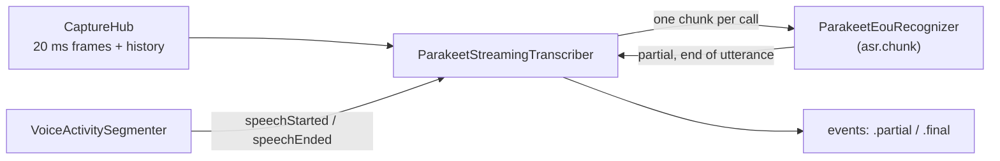

# Streaming speech recognition

`ParakeetStreamingTranscriber` (in `BlauTranscription/ASR`) turns the user's
speech into text while they talk (#29): partial transcripts that grow word
by word, and one final `Utterance` per thing they said. It runs NVIDIA's
Parakeet realtime EOU 120M (320 ms chunks) through FluidAudio's
`StreamingEouAsrManager` on the Neural Engine, only while VAD hears speech.

```swift
import BlauAudio
import BlauTranscription

guard let directory = modelManager.directory(for: .parakeetRealtimeEOU) else { return }   // docs/models.md
let transcriber = try await ParakeetStreamingTranscriber.load(
    modelDirectory: directory,
    audio: capture.hub,          // 16 kHz capture stream + 30 s history (docs/audio.md)
    voiceActivity: vad)          // VoiceActivitySegmenter running on the same hub (docs/vad.md)
try await transcriber.start()

for await event in transcriber.events {
    switch event {
    case .partial(let text, let range): ...    // replaces the previous partial
    case .final(let utterance): ...            // Utterance: text, TimeRange, startedAt, speaker .user
    case .refined: break                       // only from SecondPassTranscriber (below)
    }
}
await transcriber.stop()                       // commits what was said so far
```

`Transcriber` and `TranscriptEvent` live in `BlauCore`, so the turn
orchestrator (#36) and the views consume any transcriber (this one, the
`FakeTranscriber`, the `SpeechAnalyzer` fallback of #31) the same way.
Finals carry `speakerDecision: nil`; the voice ID gate (#47) decides who
spoke.

## Pipeline



1. **Onset.** On VAD's `speechStarted` the transcriber opens an utterance at
   the onset and reads the audio from there out of the capture history: VAD
   confirms speech 250–550 ms after it starts, and the first word must not
   be clipped.
2. **Speech.** Every captured frame goes to the recognizer.
   `ParakeetEouRecognizer` hands FluidAudio exactly the audio that completes
   the next chunk, so each model call runs one chunk: a 630 ms window that
   then moves on by 320 ms. A partial is emitted whenever the chunk decoded
   new words.
3. **End.** After VAD's `speechEnded` the transcriber keeps feeding the real
   audio (the model's end-of-utterance detector has to hear the silence) and
   commits on the first of the rules below.
4. **Commit.** The final is emitted (a blank one, noise that VAD took for
   speech, is dropped), the recognizer is **reset**, and the transcriber
   goes idle until the next onset. Nothing is decoded between utterances.

## When an utterance ends

| Rule | Default | Commit |
| --- | --- | --- |
| The model confirms the end of utterance | EOU token + 640 ms debounce (`ParakeetEouRecognizer.defaultEndOfUtteranceDebounce`) | At the model's decision; audio after it belongs to the next utterance |
| **VAD fallback**: VAD reported the end of speech and no new speech followed | `silenceCommitDelay` 0.9 s after the end of the speech | Flush up to the end of speech (words after it are dropped), then reset |
| The utterance is too long | `maximumUtteranceDuration` 30 s | Flush and reset; if speech goes on, the next utterance starts at the cut |
| The audio stream ends, or `stop()` | | Flush and reset |
| The recognizer throws | | What was decoded so far; the failing audio is skipped |

Speech that resumes before the fallback fires (VAD reports a new onset)
stays in the same utterance, so a short pause to think doesn't split a
sentence. When VAD confirms resumed speech only after the fallback already
committed (the onset is 250–550 ms old by then), the next utterance still
starts at the onset, never inside the previous utterance's speech. The
fallback's flush has by then decoded up to 0.9 s past the end of speech,
which can hold the start of the resumed speech, so it keeps only the tokens
timestamped up to VAD's end of speech plus one encoder frame (80 ms): each
word lands in exactly one utterance
(`speechConfirmedAfterTheFallbackIsNeitherRepeatedNorLost`).

### Why the VAD fallback, and not the model, sets the latency

The issue proposed `eouDebounceMs ≈ 800` with VAD as a fallback.
Measured on the fixtures with the real model
(`ParakeetLiveTests.theModelsEndOfUtteranceSignalTiming`, no debounce at
all), Parakeet's EOU token arrives **0.8–1.4 s** after the speech ends, and
for 7 of 12 utterances not at all before the next one starts (or the
fixture ends). FluidAudio's
debounce comes on top, counted in decoded audio, so it rounds up to whole
320 ms chunks (800 ms is three chunks, 960 ms). The model alone can't keep
the end-of-utterance-to-final time under 1.2 s.

So the end of speech that VAD reports (to 16 ms, 0.3–0.55 s after the
speech) starts a 0.9 s timer on the audio timeline, and the utterance is
committed then unless speech resumes or the model ended it first. The
model's detector still ends utterances that VAD can't (steady noise that
keeps a segment open), and its debounce of two chunks (640 ms) keeps a
stray EOU token from cutting a sentence.

### The flush and `reset()` after every utterance

FluidAudio keeps every token since its last `reset()` and decodes all of
them again for each partial, so without a reset the work per chunk grows
for the whole conversation. The transcriber flushes the recognizer
(`finish(keepingTokensThrough:)`) only when it needs the buffered audio
decoded (every rule except the model's own end of utterance, where the
audio after the decision belongs to the next utterance) and calls
**`reset()` after every commit**.

The flush doesn't use FluidAudio's `finish()`: that clears the token
timestamps before it returns (so the tokens can't be cut at the end of
speech), decodes only one chunk's output span (320 ms) of the padded
buffer, dropping the rest when more is buffered (a `stop()` within 630 ms
of an onset), and keeps the confirmed end-of-utterance flag and the encoder
caches. `ParakeetEouRecognizer` instead pads the buffer with
`injectSilence` one chunk at a time and runs `processBufferedAudio()` until
the audio up to the cutoff (or all of it) is decoded, then rebuilds the text
from `getRawTokenStrings()` for the tokens whose `getTokenTimestampsMs()`
value is within the cutoff, as FluidAudio's tokenizer does (pieces joined,
U+2581 to a space, trimmed). On a silence commit at 320 ms chunks the audio
up to the cutoff is already decoded, so the flush runs no extra chunk.
`TranscriberSoakTests` checks over an hour that the recognizer's history
never exceeds the longest sentence.

### Chunk size and the thermal hook

`ASRChunkSizePolicy` picks the chunk size between utterances (never
mid-utterance; a recognizer's state can't move between sizes), and a
`RecognizerProvider` supplies a recognizer for it. `ThermalASRChunkSizePolicy`
moves to 1280 ms chunks (about a quarter of the model calls, slower
partials) at `ProcessInfo.ThermalState.serious` and back at `nominal`
(`fair` keeps what is running). Blau installs only the 320 ms export
(`ModelID.parakeetRealtimeEOU`), so the provider returns `nil` for 1280 ms
and the transcriber stays at 320 ms without asking again. Adding the
1280 ms (and, for lower partial latency, the 160 ms) export to the model
manifest is left to the thermal and power work (#75).

### Autorelease pools

The issue asked for `autoreleasepool` around per-chunk work.
`autoreleasepool` takes a synchronous closure and the chunk itself is an
`await` into FluidAudio's actor, so it can't be wrapped. The recognizer
builds each chunk's `AVAudioPCMBuffer` inside a pool; the Core ML objects
FluidAudio creates are released when its job ends (Swift concurrency runs
each job on a dispatch worker that drains its pool). The hour-long replay
on the real model shows a flat footprint (below).

## Telemetry

| What | Where |
| --- | --- |
| `asr.chunk` interval | One per model chunk, from `ParakeetEouRecognizer` (canonical, [performance.md](performance.md)) |
| `asr.eou` interval | From VAD's end of speech to the decision; the end message is the reason (`endOfUtterance`, `silence`, `maximumLength`, `streamEnded`, `stopped`) or `resumed`. Reported to MetricKit |
| Utterance committed | `Log.asr` info: number, reason, sample range, length; the text as `.private` |
| Recognizer failures, skipped audio | `Log.asr` error (first failure, then every 100th in a row) / notice |
| `statistics` | `StreamingTranscriberStatistics`: utterances and commits by reason, blank utterances, partials, chunks, model time and slowest chunk, samples transcribed and missed, failures, chunk size changes, end-of-speech-to-commit delay (mean and worst, audio time) |

## Results

Recorded 2026-10-07 on an Apple M3 Max (Mac15,8), macOS 27.2, debug build,
with other builds running on the host. Latencies are audio time plus the
compute of the call that emitted the event.

`ParakeetLiveTests` (the VAD fixtures with Silero's recorded events, real
Parakeet model):

| Fixture | WER | End of speech → final |
| --- | --- | --- |
| `conversation-quiet` (4 recognizable utterances) | 0.04 | 0.96–1.06 s |
| `conversation-noisy` (18 dB SNR) | 0.08 | 0.89–0.97 s |
| `monologue-long` (13.4 s) | 0.04 | 0.96–0.99 s |
| `pauses` (200 ms pause kept, 700 ms pause) | 0.09 | 0.95–1.01 s |

- The fifth `conversation-quiet` utterance uses macOS's "Fred", a formant
  synthesizer: Parakeet decodes no words from it at all (also with the raw
  FluidAudio manager), and the transcriber drops the blank utterance.
- Partials: when a partial comes out, its decoded audio ends 0.33–0.35 s
  behind the input (one 320 ms chunk shift plus 18–45 ms of compute), so a
  word appears 0.33–0.65 s after it is spoken.

`ParakeetLiveTests.anHourOfSpeechKeepsMemoryAndChunkTimeFlat`
(`BLAU_ASR_SOAK=1`): 60 minutes of the fixtures looped, 704 utterances,
8,576 chunks per run. Two runs, the second on the final code with the host
busier:

| | Run 1, minutes 6–11 | Run 1, minutes 55–60 | Run 2, early | Run 2, late |
| --- | --- | --- | --- | --- |
| Mean time per chunk | 18.5 ms | 21.6 ms | 32.3 ms | 35.4 ms |
| Process footprint | 286 MB | 271 MB | 288 MB | 264 MB |

Within a run the chunk time moved between about 18 and 56 ms with the
host's load (other builds ran in parallel) and showed no trend. The
footprint never grew: it peaked in the first quarter of an hour and ended
15 MB below where it started.

## Second pass: punctuation and accuracy

The streaming EOU model writes lowercase text without punctuation ("i think
we moved it to the second week of march"). `SecondPassTranscriber` (in
`BlauTranscription/SecondPass`, #30) re-transcribes every committed
utterance with **Parakeet TDT 0.6B v3** and replaces the text with the
punctuated, capitalized and usually more accurate version ("I think we
moved it to the second week of March.") for display, storage and memory.

```swift
let transcriber = SecondPassTranscriber(
    wrapping: streaming,                       // ParakeetStreamingTranscriber
    audio: capture.hub,                        // the same capture history
    recognizer: ParakeetTdtRecognizer.provider(modelManager: modelManager),
    flags: flags)                              // FeatureFlag.secondPassASR
try await transcriber.start()

for await event in transcriber.events {
    switch event {
    case .partial(let text, let range): ...    // as before
    case .final(let utterance):                // as before: send to Grok now, store, show
        try await realtime.send(utterance)
        try await store.commitUtterance(utterance)
    case .refined(let utterance):              // same id, better text
        try await store.commitUtterance(utterance)   // updates the row, no duplicate
        // and replace the shown text; don't send it to Grok again
    }
}
```

It wraps any `Transcriber`, so the turn orchestrator (#36) and the views
consume it like the streaming transcriber, plus one new event,
`TranscriptEvent.refined(Utterance)`: the same `id`, `timeRange`, speaker
and start time as the `.final` it refines, with new text. It can arrive
after later events. `ConversationStore.commitUtterance` already updates the
stored row when an utterance with the same `id` is committed again (also
after the conversation ended or a relaunch). The chat view (#42) should
swap the text with a subtle animation, for example
`.contentTransition(.interpolate)` inside a short `withAnimation`, and no
animation when Reduce Motion is on.

### Turn latency is unchanged

The streaming text goes to Grok exactly as before: each `.partial` and
`.final` is forwarded the moment the wrapped transcriber emits it, before
the second pass does anything. Only then is the utterance's audio copied
out of the capture history (a memcpy of at most 32 s), and the model runs
on a separate, `.utility` priority task that the forwarding never waits
for. A second pass that never finishes delays no event
(`aStuckSecondPassDelaysNoOtherEvent`). On a device, compare
`realtime.firstAudio` and `asr.eou` with the `secondPassASR` flag on and
off; the `asr.secondPass` interval shows the second pass running after
the commit, while the user waits for Grok's reply.

### Audio

The second pass reads the utterance's `timeRange` (VAD's onset to VAD's
end of speech, or to the last word when the model ended the utterance)
from the capture history, with **100 ms** before it, never reaching into
the previous utterance, and **120 ms** after it (short, because when the
model splits continuous speech the next utterance starts right there).
FluidAudio pads anything shorter than 0.3 s with silence (Blau pads it
first) and runs one 15 s encoder window, or overlapping windows for longer
audio. Each utterance decodes from a fresh decoder state.

An utterance cut at the 30 s maximum is committed just as its start leaves
a 30 s history, so the capture hub needs
`SecondPassConfiguration.requiredHistory(for:)` (32.1 s with the defaults)
of history for those to keep their second pass. Wire the live pipeline
with `CaptureHub.Configuration(historyDuration: .seconds(33))` or more;
the extra 3 s costs 192 KB.

### When it keeps the streaming text

| Reason (`SecondPassSkipReason`) | When |
| --- | --- |
| `disabled` | The `secondPassASR` flag is off (read for every utterance, so it can be toggled mid-conversation) |
| `thermalPressure` | `ProcessInfo.thermalState` is `.serious` or `.critical` (checked when the utterance is committed and again when its turn comes) |
| `modelUnavailable` | Parakeet TDT v3 isn't installed (it is optional; asked again for every utterance, so a download that finishes mid-conversation is picked up), or it failed to load (retried after 10 utterances) |
| `audioUnavailable` | The utterance's start already left the capture history |
| `backlog` | More than 4 utterances were waiting; the oldest waiting one is dropped |
| `failed` | The model threw |
| `blank` | The model heard no words |
| `diverged` | The model changed more than 60% of the streaming transcript's words (edit distance over words, ignoring case and punctuation; transcripts under 3 words are exempt). That is a misfire, such as audio from the wrong span, not a correction |

Identical text counts as `utterancesUnchanged` and emits no event.
`SecondPassStatistics` counts all of it, plus recognizer time, the slowest
utterance and the real-time factor.

### Model and memory

`ParakeetTdtRecognizer` loads the model from Blau's model store with
`AsrModels.loadLocal(from:version: .v3)` (FluidAudio's downloader stays
off, see [models.md](models.md)) on the first utterance that needs it and
keeps it for the life of the transcriber. A warm load takes about 1.2 s
(the Neural Engine compile, minutes on a first launch, happens when
`ModelManager` warms the model after the download). Its Neural Engine
footprint is large (468 MB of neural ledger on the Mac,
[benchmarks.md](benchmarks.md)), which the device checks below have to
confirm next to the other models.

### Results

`SecondPassLiveTests` (real models, recorded 2026-10-07 on an Apple M3 Max,
macOS 27.2, debug build, other builds running on the host):

| Check | Result |
| --- | --- |
| Each labelled fixture sentence through TDT v3 with the second pass's padding | 11 of 11 start with a capital and end in `.`, `?` or `!`; WER 0.009; 33.4 s of audio in 0.98 s (RTF 0.03) |
| The streaming model's finals on the four fixtures, refined end to end | 11 of 11 refined, none skipped; WER 0.054 (streaming) → 0.027 (refined); 42–106 ms per utterance after the first (526 ms, the warm-up) |

Examples from the end-to-end run:

| Streaming final | Refined |
| --- | --- |
| can you remind me what we decided about the launch date | Can you remind me what we decided about the launch date? |
| i think we moved it to the second week of march | I think we moved it to the second week of March. |
| should we move the haik to sunday den | Should we move the high to Sunday then? |
| let me think about the for a moment | Let me think about that for a moment. |

## Tests

| Where | What | Runs |
| --- | --- | --- |
| `Tests/BlauTranscriptionTests/ASR/ParakeetStreamingTranscriberTests.swift` | Every rule on a simulated recognizer with Parakeet's chunk timing and FluidAudio's debounce: fixtures committed within 1.2 s, pauses, resumption, the VAD race, maximum length without gaps or repeats, history read-back, blank and failing utterances, partial ranges, wall-clock start, `asr.eou` messages, `start`/`stop`/stream end, chunk-size switching | `swift test` |
| `Tests/BlauTranscriptionTests/ASR/TranscriberSoakTests.swift` | An hour of looped fixtures (2 s): every sentence of every repeat, the recognizer's history bounded by one sentence, work per chunk flat, nothing skipped or repeated | `swift test` |
| `Tests/BlauTranscriptionTests/ASR/ParakeetEouRecognizerTests.swift` | Chunk geometry against FluidAudio's `StreamingChunkSize`, the installed export, loading errors | `swift test` |
| `Tests/BlauTranscriptionTests/ASR/ParakeetLiveTests.swift` | The fixtures through the **real model** (WER, latency), the raw EOU timing, and the hour-long soak | `BLAU_ASR_MODEL_DIR` (and `BLAU_ASR_SOAK=1`) |
| `Tests/BlauTranscriptionTests/SecondPass/SecondPassTranscriberTests.swift` | Finals forwarded before the second pass runs (and with it stuck), `.refined` keeps the identity, audio span and padding, history requirement, flag, thermal skip, model install and load retry, failures, blank/unchanged/diverged, backlog, stream end, `asr.secondPass` messages | `swift test` |
| `Tests/BlauTranscriptionTests/SecondPass/TranscriptComparisonTests.swift` | Word comparison, TDT input minimum, model files | `swift test` |
| `Tests/BlauTranscriptionTests/SecondPass/SecondPassLiveTests.swift` | The fixtures through the **real** TDT v3 model: punctuation, capitalization, WER; end to end with the real streaming model | `BLAU_TDT_MODEL_DIR` (and `BLAU_ASR_MODEL_DIR`) |

```sh
cd Packages/BlauKit
BLAU_MODEL_DOWNLOAD_SMOKE=1 BLAU_MODEL_DOWNLOAD_SMOKE_MODELS=parakeetRealtimeEOU \
  BLAU_MODEL_DOWNLOAD_SMOKE_DIR=/tmp/blau-models swift test --filter ModelDownloadSmokeTests
BLAU_ASR_MODEL_DIR=/tmp/blau-models/parakeetRealtimeEOU/<revision> swift test --filter ParakeetLiveTests
BLAU_ASR_SOAK=1 BLAU_ASR_MODEL_DIR=... swift test --filter ParakeetLiveTests/anHourOfSpeech
BLAU_TDT_MODEL_DIR=/tmp/blau-models/parakeetTDTv3/<revision> BLAU_ASR_MODEL_DIR=... \
  swift test --filter SecondPassLiveTests
```

`BLAU_ASR_EOU_DEBOUNCE_MS` and `BLAU_ASR_SILENCE_COMMIT_MS` try other
settings in the live tests.

## On a device

These need a physical iPhone (A17 or later) and are recorded here when run.

| Check | How | Result |
| --- | --- | --- |
| Partial text < 400 ms after speech | Release build, speak short phrases; Instruments: `asr.chunk` durations and the time from a word's end in the waveform to its partial on screen. With 320 ms chunks a word needs 0.33–0.65 s of audio before it can be decoded (see Results), so this likely needs the 160 ms export | Pending |
| Final < 1.2 s after the user stops | `asr.eou` interval (VAD's end of speech → decision) plus VAD's 0.3–0.55 s; `statistics.slowestEndOfSpeechCommit` | Pending |
| An hour: flat memory and chunk time | Record a one-hour conversation (or play the looped fixtures into the mic) with the **Blau** Instruments template: Allocations growth, `asr.chunk` durations at the start and the end | Pending |
| Screen locked (iOS 27 Neural Engine restriction, #26) | Lock mid-session: partials keep coming (Core ML falls back to the CPU), check `asr.chunk` durations | Pending |
| Second pass: stored utterances punctuated | Talk for a few minutes with the TDT v3 model installed; the stored utterances (the SwiftData store) have punctuation and capitals; `SecondPassStatistics` shows no `audioUnavailable` or `backlog` skips | Pending |
| Second pass: turn latency unchanged | Same scripted conversation (or looped fixtures into the mic) with `secondPassASR` on and off (`-blau.featureFlag.secondPassASR NO`); compare `realtime.firstAudio` and `asr.eou` p50/p95 in Instruments, and check `asr.secondPass` overlaps the wait for Grok, not the next `asr.chunk` | Pending |
| Second pass: per-utterance time and memory | `asr.secondPass` durations (expect well under the time Grok takes to answer) and the footprint with all models loaded, screen on and locked (CPU fallback) | Pending |
