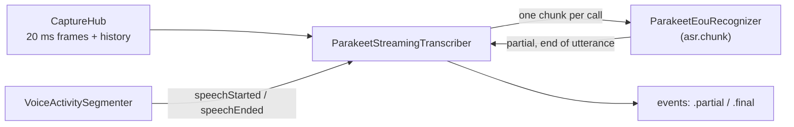

# Streaming speech recognition

`ParakeetStreamingTranscriber` (in `BlauTranscription/ASR`) turns the user's
speech into text while they talk (#29): partial transcripts that grow word
by word, and one final `Utterance` per thing they said. It runs NVIDIA's
Parakeet realtime EOU 120M (320 ms chunks) through FluidAudio's
`StreamingEouAsrManager` on the Neural Engine, only while VAD hears speech.

```swift
import BlauAudio
import BlauTranscription

guard let directory = modelManager.directory(for: .parakeetRealtimeEOU) else { return }   // docs/models.md
let transcriber = try await ParakeetStreamingTranscriber.load(
    modelDirectory: directory,
    audio: capture.hub,          // 16 kHz capture stream + 30 s history (docs/audio.md)
    voiceActivity: vad)          // VoiceActivitySegmenter running on the same hub (docs/vad.md)
try await transcriber.start()

for await event in transcriber.events {
    switch event {
    case .partial(let text, let range): ...    // replaces the previous partial
    case .final(let utterance): ...            // Utterance: text, TimeRange, startedAt, speaker .user
    }
}
await transcriber.stop()                       // commits what was said so far
```

`Transcriber` and `TranscriptEvent` live in `BlauCore`, so the turn
orchestrator (#36) and the views consume any transcriber (this one, the
`FakeTranscriber`, the `SpeechAnalyzer` fallback of #31) the same way.
Finals carry `speakerDecision: nil`; the voice ID gate (#47) decides who
spoke.

## Pipeline



1. **Onset.** On VAD's `speechStarted` the transcriber opens an utterance at
   the onset and reads the audio from there out of the capture history: VAD
   confirms speech 250–550 ms after it starts, and the first word must not
   be clipped.
2. **Speech.** Every captured frame goes to the recognizer.
   `ParakeetEouRecognizer` hands FluidAudio exactly the audio that completes
   the next chunk, so each model call runs one chunk: a 630 ms window that
   then moves on by 320 ms. A partial is emitted whenever the chunk decoded
   new words.
3. **End.** After VAD's `speechEnded` the transcriber keeps feeding the real
   audio (the model's end-of-utterance detector has to hear the silence) and
   commits on the first of the rules below.
4. **Commit.** The final is emitted (a blank one, noise that VAD took for
   speech, is dropped), the recognizer is **reset**, and the transcriber
   goes idle until the next onset. Nothing is decoded between utterances.

## When an utterance ends

| Rule | Default | Commit |
| --- | --- | --- |
| The model confirms the end of utterance | EOU token + 640 ms debounce (`ParakeetEouRecognizer.defaultEndOfUtteranceDebounce`) | At the model's decision; audio after it belongs to the next utterance |
| **VAD fallback**: VAD reported the end of speech and no new speech followed | `silenceCommitDelay` 0.9 s after the end of the speech | Flush (FluidAudio's `finish()`), then reset |
| The utterance is too long | `maximumUtteranceDuration` 30 s | Flush and reset; if speech goes on, the next utterance starts at the cut |
| The audio stream ends, or `stop()` | | Flush and reset |
| The recognizer throws | | What was decoded so far; the failing audio is skipped |

Speech that resumes before the fallback fires (VAD reports a new onset)
stays in the same utterance, so a short pause to think doesn't split a
sentence. When VAD confirms resumed speech only after the fallback already
committed (the onset is 250–550 ms old by then), the next utterance still
starts at the onset, never inside the previous utterance's speech.

### Why the VAD fallback, and not the model, sets the latency

The issue proposed `eouDebounceMs ≈ 800` with VAD as a fallback.
Measured on the fixtures with the real model
(`ParakeetLiveTests.theModelsEndOfUtteranceSignalTiming`, no debounce at
all), Parakeet's EOU token arrives **0.8–1.4 s** after the speech ends, and
for 7 of 12 utterances not at all before the next one starts (or the
fixture ends). FluidAudio's
debounce comes on top, counted in decoded audio, so it rounds up to whole
320 ms chunks (800 ms is three chunks, 960 ms). The model alone can't keep
the end-of-utterance-to-final time under 1.2 s.

So the end of speech that VAD reports (to 16 ms, 0.3–0.55 s after the
speech) starts a 0.9 s timer on the audio timeline, and the utterance is
committed then unless speech resumes or the model ended it first. The
model's detector still ends utterances that VAD can't (steady noise that
keeps a segment open), and its debounce of two chunks (640 ms) keeps a
stray EOU token from cutting a sentence.

### `finish()` and `reset()` after every utterance

FluidAudio keeps every token since its last `reset()` and decodes all of
them again for each partial, so without a reset the work per chunk grows
for the whole conversation. Its `finish()` decodes the buffered audio and
clears the tokens, but keeps the confirmed end-of-utterance flag (no later
end would ever fire) and the encoder caches. The transcriber therefore
calls `finish()` only when it needs the buffered audio decoded (every rule
except the model's own end of utterance, where the audio after the decision
belongs to the next utterance) and **`reset()` after every commit**.
`TranscriberSoakTests` checks over an hour that the recognizer's history
never exceeds the longest sentence.

### Chunk size and the thermal hook

`ASRChunkSizePolicy` picks the chunk size between utterances (never
mid-utterance; a recognizer's state can't move between sizes), and a
`RecognizerProvider` supplies a recognizer for it. `ThermalASRChunkSizePolicy`
moves to 1280 ms chunks (about a quarter of the model calls, slower
partials) at `ProcessInfo.ThermalState.serious` and back at `nominal`
(`fair` keeps what is running). Blau installs only the 320 ms export
(`ModelID.parakeetRealtimeEOU`), so the provider returns `nil` for 1280 ms
and the transcriber stays at 320 ms without asking again. Adding the
1280 ms (and, for lower partial latency, the 160 ms) export to the model
manifest is left to the thermal and power work (#75).

### Autorelease pools

The issue asked for `autoreleasepool` around per-chunk work.
`autoreleasepool` takes a synchronous closure and the chunk itself is an
`await` into FluidAudio's actor, so it can't be wrapped. The recognizer
builds each chunk's `AVAudioPCMBuffer` inside a pool; the Core ML objects
FluidAudio creates are released when its job ends (Swift concurrency runs
each job on a dispatch worker that drains its pool). The hour-long replay
on the real model shows a flat footprint (below).

## Telemetry

| What | Where |
| --- | --- |
| `asr.chunk` interval | One per model chunk, from `ParakeetEouRecognizer` (canonical, [performance.md](performance.md)) |
| `asr.eou` interval | From VAD's end of speech to the decision; the end message is the reason (`endOfUtterance`, `silence`, `maximumLength`, `streamEnded`, `stopped`) or `resumed`. Reported to MetricKit |
| Utterance committed | `Log.asr` info: number, reason, sample range, length; the text as `.private` |
| Recognizer failures, skipped audio | `Log.asr` error (first failure, then every 100th in a row) / notice |
| `statistics` | `StreamingTranscriberStatistics`: utterances and commits by reason, blank utterances, partials, chunks, model time and slowest chunk, samples transcribed and missed, failures, chunk size changes, end-of-speech-to-commit delay (mean and worst, audio time) |

## Results

Recorded 2026-10-07 on an Apple M3 Max (Mac15,8), macOS 27.2, debug build,
with other builds running on the host. Latencies are audio time plus the
compute of the call that emitted the event.

`ParakeetLiveTests` (the VAD fixtures with Silero's recorded events, real
Parakeet model):

| Fixture | WER | End of speech → final |
| --- | --- | --- |
| `conversation-quiet` (4 recognizable utterances) | 0.04 | 0.96–1.06 s |
| `conversation-noisy` (18 dB SNR) | 0.08 | 0.89–0.97 s |
| `monologue-long` (13.4 s) | 0.04 | 0.96–0.99 s |
| `pauses` (200 ms pause kept, 700 ms pause) | 0.09 | 0.95–1.01 s |

- The fifth `conversation-quiet` utterance uses macOS's "Fred", a formant
  synthesizer: Parakeet decodes no words from it at all (also with the raw
  FluidAudio manager), and the transcriber drops the blank utterance.
- Partials: when a partial comes out, its decoded audio ends 0.33–0.35 s
  behind the input (one 320 ms chunk shift plus 18–45 ms of compute), so a
  word appears 0.33–0.65 s after it is spoken.

`ParakeetLiveTests.anHourOfSpeechKeepsMemoryAndChunkTimeFlat`
(`BLAU_ASR_SOAK=1`): 60 minutes of the fixtures looped, 704 utterances,
8,576 chunks per run. Two runs, the second on the final code with the host
busier:

| | Run 1, minutes 6–11 | Run 1, minutes 55–60 | Run 2, early | Run 2, late |
| --- | --- | --- | --- | --- |
| Mean time per chunk | 18.5 ms | 21.6 ms | 32.3 ms | 35.4 ms |
| Process footprint | 286 MB | 271 MB | 288 MB | 264 MB |

Within a run the chunk time moved between about 18 and 56 ms with the
host's load (other builds ran in parallel) and showed no trend. The
footprint never grew: it peaked in the first quarter of an hour and ended
15 MB below where it started.

## Tests

| Where | What | Runs |
| --- | --- | --- |
| `Tests/BlauTranscriptionTests/ASR/ParakeetStreamingTranscriberTests.swift` | Every rule on a simulated recognizer with Parakeet's chunk timing and FluidAudio's debounce: fixtures committed within 1.2 s, pauses, resumption, the VAD race, maximum length without gaps or repeats, history read-back, blank and failing utterances, partial ranges, wall-clock start, `asr.eou` messages, `start`/`stop`/stream end, chunk-size switching | `swift test` |
| `Tests/BlauTranscriptionTests/ASR/TranscriberSoakTests.swift` | An hour of looped fixtures (2 s): every sentence of every repeat, the recognizer's history bounded by one sentence, work per chunk flat, nothing skipped or repeated | `swift test` |
| `Tests/BlauTranscriptionTests/ASR/ParakeetEouRecognizerTests.swift` | Chunk geometry against FluidAudio's `StreamingChunkSize`, the installed export, loading errors | `swift test` |
| `Tests/BlauTranscriptionTests/ASR/ParakeetLiveTests.swift` | The fixtures through the **real model** (WER, latency), the raw EOU timing, and the hour-long soak | `BLAU_ASR_MODEL_DIR` (and `BLAU_ASR_SOAK=1`) |

```sh
cd Packages/BlauKit
BLAU_MODEL_DOWNLOAD_SMOKE=1 BLAU_MODEL_DOWNLOAD_SMOKE_MODELS=parakeetRealtimeEOU \
  BLAU_MODEL_DOWNLOAD_SMOKE_DIR=/tmp/blau-models swift test --filter ModelDownloadSmokeTests
BLAU_ASR_MODEL_DIR=/tmp/blau-models/parakeetRealtimeEOU/<revision> swift test --filter ParakeetLiveTests
BLAU_ASR_SOAK=1 BLAU_ASR_MODEL_DIR=... swift test --filter ParakeetLiveTests/anHourOfSpeech
```

`BLAU_ASR_EOU_DEBOUNCE_MS` and `BLAU_ASR_SILENCE_COMMIT_MS` try other
settings in the live tests.

## On a device

These need a physical iPhone (A17 or later) and are recorded here when run.

| Check | How | Result |
| --- | --- | --- |
| Partial text < 400 ms after speech | Release build, speak short phrases; Instruments: `asr.chunk` durations and the time from a word's end in the waveform to its partial on screen. With 320 ms chunks a word needs 0.33–0.65 s of audio before it can be decoded (see Results), so this likely needs the 160 ms export | Pending |
| Final < 1.2 s after the user stops | `asr.eou` interval (VAD's end of speech → decision) plus VAD's 0.3–0.55 s; `statistics.slowestEndOfSpeechCommit` | Pending |
| An hour: flat memory and chunk time | Record a one-hour conversation (or play the looped fixtures into the mic) with the **Blau** Instruments template: Allocations growth, `asr.chunk` durations at the start and the end | Pending |
| Screen locked (iOS 27 Neural Engine restriction, #26) | Lock mid-session: partials keep coming (Core ML falls back to the CPU), check `asr.chunk` durations | Pending |
