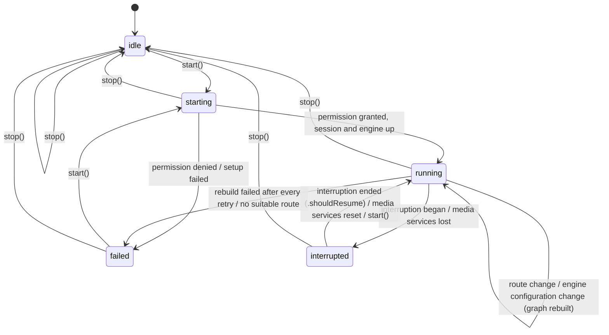
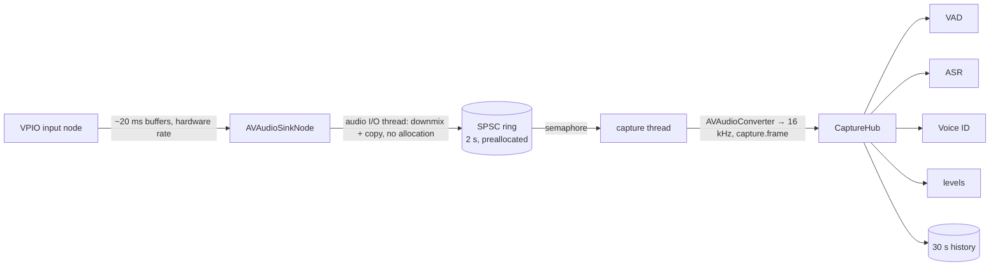

# Audio session

`AudioSessionController` (in `BlauAudio`) owns `AVAudioSession` and the
voice-processing `AVAudioEngine` for the whole conversation. It brings them
up, publishes their state and route for the UI, and keeps them running
through phone calls, route changes and media-server resets. Capture (#24)
and playback (#25, [below](#playback-25)) plug into its engine as graph
components. Backgrounding and screen lock (#26) are handled one level up by
`AudioSessionKeeper`, the app's `AudioService`, which keeps this controller
running off screen and recovers silent stalls: see
[background.md](background.md).

```swift
import BlauAudio

let audio = AudioSessionController.live()   // iOS only
await audio.register(capture)               // MicrophoneCapture, #24 (see "Capture" below)
await audio.register(playbackNode)          // AudioGraphComponent, #25
await audio.start()

for await snapshot in await audio.updates() {
    // snapshot.state: idle, starting, running, interrupted, failed(AudioSessionError)
    // snapshot.route: inputs and outputs (built-in mic, speaker, AirPods...)
}

await audio.stop()
```

## Session setup

`start()` applies `AudioSessionConfiguration.voiceChat`:

| Setting | Value | Why |
| ------- | ----- | --- |
| Category | `.playAndRecord` | Capture and playback at the same time, for the whole session |
| Mode | `.voiceChat` | Tells the system this is a two-way voice conversation; pairs with voice processing |
| Options | `[.defaultToSpeaker, .allowBluetoothHFP]` | Loudspeaker rather than receiver when no headset; AirPods and headsets as mic + speaker. `.allowBluetoothHFP` is the iOS 26 SDK name of `.allowBluetooth` |
| Preferred sample rate | 48 kHz | The hardware rate on the built-in route. Bluetooth HFP still runs at 16 or 24 kHz; components read the real format from the nodes |
| Preferred I/O buffer | 20 ms | Low latency without waking the CPU too often over an hour |
| Voice processing | On, AGC on, advanced ducking, ducking level `.min` | Echo cancellation, noise suppression and gain control; other apps' audio is only lowered while someone talks |
| Microphone permission | `AVAudioApplication.requestRecordPermission()` | Asked on the first `start()` if undetermined |

Order matters. `start()` stops the engine, configures and activates the
session, then **enables voice processing on the stopped engine**
(`inputNode.setVoiceProcessingEnabled(true)`, which also enables it on the
output node), installs the graph components, prepares and starts the
engine. Voice processing can only be switched while the engine is stopped,
and the input format it produces is only final once it is on, so the
components must be installed after it.

## States



`AudioSessionError` says what failed: `microphonePermissionDenied`,
`configurationFailed`, `activationFailed` (for example
`insufficientPriority` while a call holds the mic), `graphSetupFailed`,
`engineStartFailed` or `noSuitableRoute`. The wrapped `SystemError` keeps the
`NSError` domain and code.

The issue sketched the failed state as `failed(Error)`. It is
`failed(AudioSessionError)` instead so `AudioSessionState` stays `Sendable`
and `Equatable`, which the UI and the tests compare against.

## What the controller handles

| System event | While running | Otherwise |
| ------------ | ------------- | --------- |
| Interruption began (call, Siri, alarm, another app) | Stop the engine, `interrupted` | Ignored |
| Interruption ended with `.shouldResume` | Reactivate, rebuild the graph, `running` | Ignored |
| Interruption ended without `.shouldResume` | Stay `interrupted` until `start()` (Apple's guidance: don't resume unasked) | Ignored |
| Route change (AirPods in or out, speaker override, car) | Publish the new route; rebuild if the engine stopped without a configuration change | Publish the new route |
| Route change, `categoryChange` | Re-apply the setup if another framework changed the category | Publish |
| Route change, `noSuitableRouteForCategory` | `failed(.noSuitableRoute)` | Publish |
| `AVAudioEngineConfigurationChange` (hardware rate or channel count changed, the engine stopped itself) | Rebuild the graph so formats follow the new hardware | Ignored; the next `start()` builds from scratch |
| Media services lost | `interrupted`; nothing touches the dead engine | Ignored |
| Media services reset | Create a new engine, reconfigure the session, rebuild, `running` | Create a new engine |

Rebuilds are retried after each of `RecoveryPolicy.standard`'s delays (0,
100, 250, 500 ms and 1 s): right after a Bluetooth route switch or the end
of a call, activation or `AVAudioEngine.start()` can fail for a moment. A
newer event (another interruption, `stop()`, another rebuild) cancels a
pending one. If every attempt fails the state becomes `failed`.

### Interruption notifications on iOS 27

iOS 27 deprecates `AVAudioSession.interruptionNotification` in favour of
`didBecomeInactiveNotification` (with a `DeactivationContext`) and
`resumptionRecommendationNotification` (with a `ResumptionContext`).
`SystemAudioSession` keeps observing the legacy notification, which the iOS
26 deployment target needs and iOS 27 still posts, and on iOS 27 also
observes the new pair (deactivations the app asked for are skipped). Both
describe the same interruption; the state machine treats the duplicate as a
no-op. Once the deployment target is iOS 27 the legacy observer can go.

## Graph components (#24, #25)

Capture taps and player nodes implement `AudioGraphComponent`:

```swift
public protocol AudioGraphComponent: AnyObject, Sendable {
    func install(on engine: AVAudioEngine) throws
    func uninstall(from engine: AVAudioEngine)
}
```

- `install(on:)` runs on every graph build: start, resume after an
  interruption, after a configuration change and after a media-services
  reset. Voice processing is already on and the engine is stopped. Read
  formats from the nodes then (`engine.inputNode.outputFormat(forBus: 0)`);
  they follow the route, so a capture converter built for 48 kHz must be
  rebuilt for 16 kHz HFP.
- `uninstall(from:)` runs before every rebuild and on stop: remove taps,
  detach nodes.
- After a media-services reset `install(on:)` gets a brand-new engine with
  no `uninstall` on the dead one. Drop references to the old engine's nodes.
- Register components before `start()`. Registering or unregistering while
  running rebuilds the graph, which drops a few milliseconds of audio.

## Capture (#24)

`MicrophoneCapture` is the mic capture engine. It is an
`AudioGraphComponent`: register it with the controller and subscribe to its
`hub`. VAD, voice ID and ASR take a `CaptureFrameSource` (the protocol the
hub implements) so their tests can feed fixtures.

```swift
let capture = MicrophoneCapture()
await audio.register(capture)
await audio.start()

let hub = capture.hub                          // CaptureHub: CaptureFrameSource
for await frame in hub.frames() { ... }        // AudioFrame: 16 kHz mono, 20 ms
for await level in hub.levels() { ... }        // AudioLevel for the record button meter
let lookBack = hub.frames(replaying: .seconds(2))   // history first, then live
let clip = hub.history(in: start..<end)        // absolute sample offsets, last 30 s
let stats = hub.statistics                     // CaptureStatistics, see Telemetry
```

### Pipeline



1. **Audio I/O thread.** An `AVAudioSinkNode` connected to the input node
   receives each hardware buffer on the real-time thread, at the session's
   I/O buffer size (20 ms). `CaptureProducer` downmixes it to mono (the
   first channel when voice processing is on, the channel average
   otherwise) straight into a preallocated lock-free single-producer,
   single-consumer ring, writes a small header (frame count, host time,
   drops before it) into a second ring, and signals a semaphore. If either
   ring is full the buffer is dropped and counted; the next buffer that fits
   carries the size of the gap.
2. **Capture thread.** A dedicated thread (`com.joeblau.blau.capture`,
   QoS user-interactive) wakes on the semaphore, reads each buffer,
   resamples it to 16 kHz with `AVAudioConverter` (a pass-through when the
   route already runs at 16 kHz, as Bluetooth HFP can), stamps host time and
   sample offset, and appends to the hub inside a `capture.frame` interval.
3. **Hub.** Re-chunks into 20 ms `AudioFrame`s whatever the hardware buffer
   size, keeps 30 s of history and yields the same frame values to every
   subscriber (the sample arrays are shared, not copied).

**Why a sink node rather than a tap.** The issue sketched a tap on the
input node. `installTap` buffers are 100 to 400 ms (the SDK documents that
range), delivered on an internal thread: too coarse for barge-in, and the
real-time question doesn't arise because the tap isn't on the I/O thread.
The sink node gets the real I/O buffers, and its header documents that the
voice-processing input supports it. The tap is still available as
`MicrophoneCapture.Configuration(inputMode: .tap)`, a fallback if a route
misbehaves with the sink node; both feed the same producer. The SDK 27
error-returning tap API is `NS_REFINED_FOR_SWIFT` with no public Swift
spelling, so `.tap` uses `installTap(onBus:bufferSize:format:block:)`.

### Frames, offsets and time

- `sampleOffset` counts 16 kHz samples from the start of capture. Frames
  are contiguous (`next.sampleOffset == previous.nextSampleOffset`)
  except after lost audio.
- **Drops leave gaps aligned with real time.** When the ring overflowed,
  offsets jump by the lost duration so later audio stays where it belongs;
  history reads the gap back as silence. A subscriber spots a gap by
  comparing offsets.
- **Rebuilds are contiguous.** Every graph build (start, resume, route
  change, media-services reset) starts a new capture segment that reads the
  current hardware format, so 48 kHz speaker → 16 kHz HFP just works.
  Segments run in order on the hub; the stream continues without a gap in
  offsets, and `hostTime` shows the real-time jump.
- `hostTime` is the `mach_absolute_time` of the frame's first sample. Each
  hardware buffer's own timestamp anchors the audio that follows it, so it
  doesn't drift over an hour. Frames replayed from history have none.
- A frame is shorter than 20 ms only right before a gap and at the end of a
  segment.

### Backpressure

Each subscriber buffers up to 10 s (`CaptureHub.Configuration.subscriberBuffer`).
One that falls further behind loses its oldest frames, counted in
`subscriberDroppedFrames`; the capture thread and the other subscribers
never wait for it. Levels keep only the newest value.

### Real-time safety

The audio-thread path (`CaptureProducer.write` and everything it calls) is
annotated `@_noLocks`: the compiler rejects any allocation, lock,
retain/release, generic metadata access or call into code it can't see,
in Debug and Release. The one call outside it is
`DispatchSemaphore.signal()`, an atomic increment plus a Mach trap when
the capture thread is waiting; it doesn't allocate or block.
`CaptureAllocationTests` checks the same at run time: it counts every heap
allocation the calling thread makes (through libmalloc's `malloc_logger`
hook) while it drives the sink node's receiver block thousands of times,
with the real capture thread draining concurrently and the ring
overflowing now and then, and expects zero.

## Playback (#25)

`StreamingAudioPlayer` (in `BlauAudio/Playback`) plays Grok's streamed
reply audio, 24 kHz mono PCM16 `response.output_audio.delta` events, and
stops it at once on barge-in. It is an `AudioGraphComponent`, so it lives
on the same voice-processing engine as capture and the echo canceller
hears it as the reference signal.

```swift
let player = StreamingAudioPlayer()
await audio.register(player)
await audio.start()

let item = PlaybackItemID(itemID: event.itemID, contentIndex: event.contentIndex)
try player.enqueue(base64: event.delta, item: item)   // response.output_audio.delta
player.finish(item)                                   // response.output_audio.done

// Barge-in (#37): silence first, then tell the server what was heard.
let cut = player.flush()
if let heard = cut.current {
    // conversation.item.truncate(item_id: heard.id.itemID,
    //   content_index: heard.id.contentIndex, audio_end_ms: heard.playedMilliseconds)
}

for await snapshot in player.updates() {   // "agent speaking" indicator
    snapshot.isSpeaking; snapshot.level.rms
}
```

### Design

| Concern | How |
| ------- | --- |
| Node | An `AVAudioSourceNode` rendering 24 kHz float into the main mixer, which converts to the hardware rate (48 kHz speaker, 16/24 kHz HFP). The stream is mono but the node's format has two identical channels: a mono mixer input plays at unity gain only the first time it is connected and comes back 3 dB quieter after every graph rebuild (route change); a stereo input stays at unity on mono and stereo outputs (`uninstallDetachesTheNodeAndReinstallResumesTheQueue` pins this) |
| Decoding | `PCM16Decoder`: base64 or binary little-endian PCM16 → `Float` / 32 768 with Accelerate. A delta that ends mid-sample keeps its odd byte for the next delta of the same item |
| Jitter buffer | A response starts once 120 ms is queued (`prerollDuration`), or at once when `finish` says nothing more is coming, or after `maximumPrerollWait` (300 ms) of a trickle |
| Underrun | The queue ran dry while the item is still streaming: render silence, count it, wait for `rebufferDuration` (120 ms) and resume. Nothing is dropped or reordered. Running dry after `finish` is the end of speech, not an underrun |
| Played time | Frames are credited to their item as the node renders them, so `playedItem(for:)` and `flush()` report exactly what reached the output: preroll and underrun silence are not counted. `playedMilliseconds` rounds down, for `audio_end_ms` |
| Flush | `flush()` empties the queue under the lock and returns what was played. The next render cycle plays a 5 ms linear fade of what was playing (credited as played; no click) and then silence. Items it cut are marked finished, so deltas still in flight before `response.cancel` lands are dropped |
| Level | RMS and peak of each render cycle. The render thread can't post to an `AsyncStream` without risking a glitch, so `updates(every:)` samples the player on the `BlauClock` (50 ms by default) |
| Rebuilds | The queue lives outside the node. A route change or media-services reset reinstalls the node and playback carries on where it was |

The issue suggested an `AVAudioPlayerNode` fed with scheduled
`AVAudioPCMBuffer`s. A source node pulling from our own queue fits the
requirements better: a player node's sample time keeps running through
underruns, so played time would have to be reconstructed from completion
callbacks; jitter-buffer and underrun policy would sit outside the node;
and the mixer converts the 24 kHz source just the same. Both are ordinary
nodes on the same engine, so echo cancellation is unaffected.

### Real-time safety

The render callback and the producers share one `Mutex` (`os_unfair_lock`,
which donates priority to the render thread). Every critical section is
short: producers append whole chunks; the render thread copies at most one
cycle. The render path never allocates or frees: chunks are allocated by
`enqueue`, consumed chunks are released by the next producer call outside
the lock, and per-item counters sit in a fixed ring created in `init`
(`itemHistoryCapacity`, 64 items).

### Latency budget

| Step | Time |
| ---- | ---- |
| First delta → first frame rendered (`playback.firstBuffer`) | 120 ms preroll plus up to one I/O cycle |
| `flush()` → silence | At most one I/O cycle (20 ms) until the next render, plus the 5 ms fade, plus the hardware output latency. Measured offline through the mixer: 5.7 ms after a flush between cycles |

## Telemetry

Logs go to `Log.audio` (category `audio`): every state transition, every
system event, rebuild attempts and failures. Routes are logged as port
kinds only (`bluetoothHFP -> bluetoothHFP`); port names such as "Joe's
AirPods" are never logged publicly.

Signposts on `Signposts.audio`. These are lifecycle markers rather than
pipeline stages, so they are not in the canonical interval table in
[performance.md](performance.md):

| Name | Kind | When |
| ---- | ---- | ---- |
| `audio.sessionStart` | interval | `start()` bringing the session and engine up |
| `audio.graphRebuild` | interval | One rebuild attempt after an event |
| `audio.interruptionBegan`, `audio.interruptionEnded` | event | Interruption notifications |
| `audio.routeChange` | event | Route change notifications |
| `audio.engineConfigurationChange` | event | `AVAudioEngineConfigurationChange` for the current engine |
| `audio.mediaServicesLost`, `audio.mediaServicesReset` | event | Media-server notifications |
| `audio.captureStall` | event | `recoverFromStall()`: audio stopped flowing while running, the graph is rebuilt ([background.md](background.md)) |
| `capture.drop` | event | The capture ring overflowed and audio was lost (emitted from the capture thread when the gap is accounted for) |

Capture also uses the canonical `capture.frame` interval (see
[performance.md](performance.md)): one per hardware buffer, on the capture
thread, from taking it off the ring to its 16 kHz audio reaching every
subscriber. Nothing is signposted or logged on the audio I/O thread.

### Capture counters

`CaptureHub.statistics` is a `CaptureStatistics` snapshot for the debug HUD
(#71), MetricKit diagnostics (#72) and tests:

| Counter | Counts |
| ------- | ------ |
| `droppedBuffers` | Hardware buffers the audio thread dropped because the ring was full: **the dropped-frame counter** |
| `droppedSamples`, `gaps` | 16 kHz samples lost to those drops, and how many gaps they made |
| `subscriberDroppedFrames` | Frames a subscriber lost because it fell more than 10 s behind |
| `framesPublished`, `samplesPublished` | Frames and samples fanned out |
| `conversionFailures` | Buffers `AVAudioConverter` rejected |
| `segments` | Capture segments, one per graph build |

`droppedFrames(frameLength:)` folds the capture and subscriber losses into
one number of 20 ms frames. Every drop is also logged on `Log.audio` as an
error with the totals (`Capture dropped 2 buffer(s), 640 samples at 16 kHz
(2 buffers in total); resuming at sample 1280`), a subscriber that starts
or stops dropping logs once each way, and each segment logs its totals when
it ends.

Playback adds the canonical interval `playback.firstBuffer` (in
[performance.md](performance.md)): from the first delta of a response
item reaching the player to its first rendered frame, which is the jitter
buffer's delay. Underruns are logged (`Playback underrun`) when the late
audio arrives, since the render thread can't log; flushes log the item, its
played milliseconds and how much was dropped.

## Tests

| Where | What | Runs |
| ----- | ---- | ---- |
| `Packages/BlauKit/Tests/BlauAudioTests/AudioSessionControllerTests.swift` | The state machine against a fake session, engine and permission: start/stop, permission, failures, phone-call interruption and resume, AirPods ↔ speaker, configuration changes with retries, media-services reset, published updates | `swift test` on the Mac |
| `BlauTests/SystemAudioSessionTests.swift` | The real `AVAudioSession` adapter: the category, mode and options it sets, and how it translates interruption, route-change and media-services notifications (simulated on a private notification center) | `make test-unit`, simulator |
| `BlauTests/SystemAudioSessionTests.swift`, `AudioSessionControllerLiveTests` | The live controller and voice-processing engine coming up and down | Only with `BLAU_DEVICE_TESTS=1` and microphone permission |
| `Packages/BlauKit/Tests/BlauAudioTests/Playback/StreamingAudioPlayerTests.swift` | Jitter buffer, underruns, items, flush and fade, stale deltas, levels, `updates`, the `playback.firstBuffer` signpost, cycle by cycle | `swift test` on the Mac |
| `Packages/BlauKit/Tests/BlauAudioTests/Playback/DeltaStreamPlaybackTests.swift` | The acceptance criteria against a two-minute delta stream fixture with jittered arrivals: bit-exact gapless output, played-ms vs the fixture, flush silence, recovery from a server stall | `swift test` on the Mac |
| `Packages/BlauKit/Tests/BlauAudioTests/Playback/PlaybackEngineTests.swift` | The node in a real `AVAudioEngine` in offline manual rendering mode at 48 kHz: no gap over two minutes, flush silence and played-ms measured at the engine's output, reinstall after a rebuild | `swift test` on the Mac |
| `Packages/BlauKit/Tests/BlauAudioTests/Playback/RecordedDeltaStreamTests.swift` | Replays a real capture of Grok's deltas (JSON Lines, see the file) | Only with `BLAU_PLAYBACK_RECORDING=/path/to/capture.jsonl` |
| `BlauTests/StreamingPlaybackLiveTests.swift` | The node on the live voice-processing engine: real-time pacing and flush | Only with `BLAU_DEVICE_TESTS=1` and microphone permission |
| `Packages/BlauKit/Tests/BlauAudioTests/Capture/RingBufferTests.swift` | The SPSC rings: all-or-nothing writes, wrap-around, a two-thread stress test of 2 M samples | `swift test` on the Mac |
| `Packages/BlauKit/Tests/BlauAudioTests/Capture/CaptureProducerTests.swift` | Downmixing (planar, interleaved, VPIO first channel), drops and gap reporting, host times; **zero heap allocations** on the audio-thread path (`CaptureAllocationTests`, with a positive control proving the counter works) | `swift test` on the Mac |
| `Packages/BlauKit/Tests/BlauAudioTests/Capture/CaptureResamplerTests.swift` | 48 / 44.1 / 24 kHz → 16 kHz keeps every sample, the tone and the level; chunking doesn't change the output; 16 kHz passes through | `swift test` on the Mac |
| `Packages/BlauKit/Tests/BlauAudioTests/Capture/CaptureHubTests.swift` | 20 ms re-chunking, host times, **three consumers get identical streams**, history and replay, gaps, slow subscribers, levels | `swift test` on the Mac |
| `Packages/BlauKit/Tests/BlauAudioTests/Capture/CapturePipelineTests.swift` | Producer → capture thread → hub with real threads: **three concurrent consumers get identical, sample-accurate streams** (equal to converting the whole signal at once), drops aligned with real time, segments across a 48 → 16 kHz route change | `swift test` on the Mac |
| `BlauTests/MicrophoneCaptureLiveTests.swift` | The real VPIO engine with the sink node and with the tap: three consumers get the same 16 kHz audio, contiguous offsets, host times, levels, no drops | Only with `BLAU_DEVICE_TESTS=1` and microphone permission |

The two-minute fixture is synthetic: seeded speech-like audio cut into
20–100 ms deltas that arrive 1.1–2× faster than real time with 20–60 ms of
network jitter and occasional 60 ms spikes. A real recording needs xAI
credentials; capture one by logging each server event with its receive
time as `t_ms` and replay it with `BLAU_PLAYBACK_RECORDING`.

Run the live suite on a simulator (parallel testing off, so the test runs on
the simulator that has the permission rather than a clone):

```sh
make generate
xcrun simctl boot <udid>
xcrun simctl privacy <udid> grant microphone com.joeblau.blau
TEST_RUNNER_BLAU_DEVICE_TESTS=1 xcodebuild test -project Blau.xcodeproj -scheme Blau -testPlan Blau \
  -only-testing:BlauTests -parallel-testing-enabled NO -destination 'id=<udid>' \
  -derivedDataPath .build/DerivedData CODE_SIGNING_ALLOWED=NO
```

## Manual verification on a device

Phone calls and AirPods can't be simulated, so these need a physical
iPhone. Until the record button (#41) lands, drive the controller from a
debug build that calls `start()` and plays audio through a registered
player node, and watch the logs:

```sh
log stream --level debug --predicate 'subsystem == "com.joeblau.blau" && category == "audio"'
```

| # | Scenario | Steps | Expected | Result |
| - | -------- | ----- | -------- | ------ |
| 1 | Phone call | Start a session on the speaker. Call the phone from another phone, answer, talk 10 s, hang up | `interrupted` when answered; `running` within ~1 s of hanging up without touching the app; capture and playback both work afterwards | Pending |
| 2 | Declined call | Start, receive a call, decline it | Either no interruption or `interrupted` then `running` again | Pending |
| 3 | AirPods in | Start on the speaker, put AirPods in | Route becomes `bluetoothHFP -> bluetoothHFP`; a `Rebuilt after engineConfigurationChange` log; capture and playback continue through the AirPods | Pending |
| 4 | AirPods out | With audio on AirPods, take them out (or put them in the case) | Route falls back to `builtInMic -> builtInSpeaker`; audio keeps running on the speaker | Pending |
| 5 | Route picker | Switch AirPods → iPhone → AirPods from Control Center mid-session | Route follows each switch; `running` throughout | Pending |
| 6 | Siri | Start, invoke Siri, dismiss | `interrupted`, then `running` | Pending |
| 7 | Media services reset | Settings → Developer → Reset Media Services mid-session | `Media services were reset` log; `running` again with a new engine | Pending |
| 8 | Echo | Speaker route, play agent audio while silent | Captured level stays near the noise floor (voice processing removes the playback) | Pending |
| 9 | Gapless reply | Ask Grok for a two-minute answer on the speaker and on AirPods | No clicks, gaps or stutter; no `Playback underrun` logs on a good network | Pending |
| 10 | Barge-in | Talk over the agent mid-sentence | Agent audio stops within ~50 ms with no click; a `Flushed playback` log with the played ms | Pending |
| 11 | Played ms | Barge in, then compare `audio_end_ms` in the truncate event with a screen recording's audio | Within ±20 ms | Pending |
| 12 | Route change mid-reply | Connect AirPods while the agent speaks | Playback continues after the rebuild at the same loudness | Pending |

### Capture on a device (#24)

Run the same debug build with a `MicrophoneCapture` registered and three
subscribers (or the live suite above on the device), and watch
`log stream ... category == "audio"` for `Capture dropped` lines.

| # | Scenario | Steps | Expected | Result |
| - | -------- | -------- | -------- | ------ |
| C1 | No allocations on the audio thread | Profile a Release build with Instruments' **Allocations** template (or **System Trace** plus Allocations). Record 60 s of speech, then filter the allocation list by thread to the audio I/O thread (`AURemoteIO::IOThread` or similar; the one running `MicrophoneCapture.sinkReceiver`) | No allocation whose stack contains `CaptureProducer` or `sinkReceiver`. Allocations by Apple's own I/O code on that thread, if any, are outside Blau's control; note them | Pending |
| C2 | Steady state | Speak for 10 minutes on the speaker route | `hub.statistics.droppedBuffers == 0`; no `Capture dropped` log | Pending |
| C3 | Route change | AirPods in and out mid-sentence | A new segment per rebuild (`Capture installed ... 16000 Hz` for HFP); offsets keep counting; frames keep arriving within ~1 s | Pending |
| C4 | Load | Run the ASR and voice ID models while capturing for 30 minutes | No capture drops; if any, `droppedBuffers` and the log lines show how many | Pending |
| C5 | Sink node vs tap | Repeat C2 with `inputMode: .tap` | Same audio, ~100 ms frame bursts instead of 20 ms | Pending |
