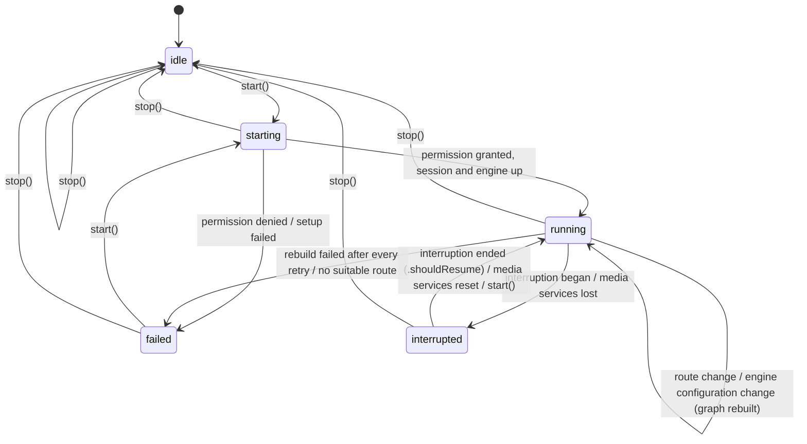

# Audio session

`AudioSessionController` (in `BlauAudio`) owns `AVAudioSession` and the
voice-processing `AVAudioEngine` for the whole conversation. It brings them
up, publishes their state and route for the UI, and keeps them running
through phone calls, route changes and media-server resets. Capture (#24)
and playback (#25) plug into its engine as graph components; backgrounding
and screen lock are #26.

```swift
import BlauAudio

let audio = AudioSessionController.live()   // iOS only
await audio.register(captureTap)            // AudioGraphComponent, #24
await audio.register(playbackNode)          // AudioGraphComponent, #25
await audio.start()

for await snapshot in await audio.updates() {
    // snapshot.state: idle, starting, running, interrupted, failed(AudioSessionError)
    // snapshot.route: inputs and outputs (built-in mic, speaker, AirPods...)
}

await audio.stop()
```

## Session setup

`start()` applies `AudioSessionConfiguration.voiceChat`:

| Setting | Value | Why |
| ------- | ----- | --- |
| Category | `.playAndRecord` | Capture and playback at the same time, for the whole session |
| Mode | `.voiceChat` | Tells the system this is a two-way voice conversation; pairs with voice processing |
| Options | `[.defaultToSpeaker, .allowBluetoothHFP]` | Loudspeaker rather than receiver when no headset; AirPods and headsets as mic + speaker. `.allowBluetoothHFP` is the iOS 26 SDK name of `.allowBluetooth` |
| Preferred sample rate | 48 kHz | The hardware rate on the built-in route. Bluetooth HFP still runs at 16 or 24 kHz; components read the real format from the nodes |
| Preferred I/O buffer | 20 ms | Low latency without waking the CPU too often over an hour |
| Voice processing | On, AGC on, advanced ducking, ducking level `.min` | Echo cancellation, noise suppression and gain control; other apps' audio is only lowered while someone talks |
| Microphone permission | `AVAudioApplication.requestRecordPermission()` | Asked on the first `start()` if undetermined |

Order matters. `start()` stops the engine, configures and activates the
session, then **enables voice processing on the stopped engine**
(`inputNode.setVoiceProcessingEnabled(true)`, which also enables it on the
output node), installs the graph components, prepares and starts the
engine. Voice processing can only be switched while the engine is stopped,
and the input format it produces is only final once it is on, so the
components must be installed after it.

## States



`AudioSessionError` says what failed: `microphonePermissionDenied`,
`configurationFailed`, `activationFailed` (for example
`insufficientPriority` while a call holds the mic), `graphSetupFailed`,
`engineStartFailed` or `noSuitableRoute`. The wrapped `SystemError` keeps the
`NSError` domain and code.

The issue sketched the failed state as `failed(Error)`. It is
`failed(AudioSessionError)` instead so `AudioSessionState` stays `Sendable`
and `Equatable`, which the UI and the tests compare against.

## What the controller handles

| System event | While running | Otherwise |
| ------------ | ------------- | --------- |
| Interruption began (call, Siri, alarm, another app) | Stop the engine, `interrupted` | Ignored |
| Interruption ended with `.shouldResume` | Reactivate, rebuild the graph, `running` | Ignored |
| Interruption ended without `.shouldResume` | Stay `interrupted` until `start()` (Apple's guidance: don't resume unasked) | Ignored |
| Route change (AirPods in or out, speaker override, car) | Publish the new route; rebuild if the engine stopped without a configuration change | Publish the new route |
| Route change, `categoryChange` | Re-apply the setup if another framework changed the category | Publish |
| Route change, `noSuitableRouteForCategory` | `failed(.noSuitableRoute)` | Publish |
| `AVAudioEngineConfigurationChange` (hardware rate or channel count changed, the engine stopped itself) | Rebuild the graph so formats follow the new hardware | Ignored; the next `start()` builds from scratch |
| Media services lost | `interrupted`; nothing touches the dead engine | Ignored |
| Media services reset | Create a new engine, reconfigure the session, rebuild, `running` | Create a new engine |

Rebuilds are retried after each of `RecoveryPolicy.standard`'s delays (0,
100, 250, 500 ms and 1 s): right after a Bluetooth route switch or the end
of a call, activation or `AVAudioEngine.start()` can fail for a moment. A
newer event (another interruption, `stop()`, another rebuild) cancels a
pending one. If every attempt fails the state becomes `failed`.

### Interruption notifications on iOS 27

iOS 27 deprecates `AVAudioSession.interruptionNotification` in favour of
`didBecomeInactiveNotification` (with a `DeactivationContext`) and
`resumptionRecommendationNotification` (with a `ResumptionContext`).
`SystemAudioSession` keeps observing the legacy notification, which the iOS
26 deployment target needs and iOS 27 still posts, and on iOS 27 also
observes the new pair (deactivations the app asked for are skipped). Both
describe the same interruption; the state machine treats the duplicate as a
no-op. Once the deployment target is iOS 27 the legacy observer can go.

## Graph components (#24, #25)

Capture taps and player nodes implement `AudioGraphComponent`:

```swift
public protocol AudioGraphComponent: AnyObject, Sendable {
    func install(on engine: AVAudioEngine) throws
    func uninstall(from engine: AVAudioEngine)
}
```

- `install(on:)` runs on every graph build: start, resume after an
  interruption, after a configuration change and after a media-services
  reset. Voice processing is already on and the engine is stopped. Read
  formats from the nodes then (`engine.inputNode.outputFormat(forBus: 0)`);
  they follow the route, so a capture converter built for 48 kHz must be
  rebuilt for 16 kHz HFP.
- `uninstall(from:)` runs before every rebuild and on stop: remove taps,
  detach nodes.
- After a media-services reset `install(on:)` gets a brand-new engine with
  no `uninstall` on the dead one. Drop references to the old engine's nodes.
- Register components before `start()`. Registering or unregistering while
  running rebuilds the graph, which drops a few milliseconds of audio.

## Telemetry

Logs go to `Log.audio` (category `audio`): every state transition, every
system event, rebuild attempts and failures. Routes are logged as port
kinds only (`bluetoothHFP -> bluetoothHFP`); port names such as "Joe's
AirPods" are never logged publicly.

Signposts on `Signposts.audio`. These are lifecycle markers rather than
pipeline stages, so they are not in the canonical interval table in
[performance.md](performance.md):

| Name | Kind | When |
| ---- | ---- | ---- |
| `audio.sessionStart` | interval | `start()` bringing the session and engine up |
| `audio.graphRebuild` | interval | One rebuild attempt after an event |
| `audio.interruptionBegan`, `audio.interruptionEnded` | event | Interruption notifications |
| `audio.routeChange` | event | Route change notifications |
| `audio.engineConfigurationChange` | event | `AVAudioEngineConfigurationChange` for the current engine |
| `audio.mediaServicesLost`, `audio.mediaServicesReset` | event | Media-server notifications |

## Tests

| Where | What | Runs |
| ----- | ---- | ---- |
| `Packages/BlauKit/Tests/BlauAudioTests/AudioSessionControllerTests.swift` | The state machine against a fake session, engine and permission: start/stop, permission, failures, phone-call interruption and resume, AirPods ↔ speaker, configuration changes with retries, media-services reset, published updates | `swift test` on the Mac |
| `BlauTests/SystemAudioSessionTests.swift` | The real `AVAudioSession` adapter: the category, mode and options it sets, and how it translates interruption, route-change and media-services notifications (simulated on a private notification center) | `make test-unit`, simulator |
| `BlauTests/SystemAudioSessionTests.swift`, `AudioSessionControllerLiveTests` | The live controller and voice-processing engine coming up and down | Only with `BLAU_DEVICE_TESTS=1` and microphone permission |

Run the live suite on a simulator (parallel testing off, so the test runs on
the simulator that has the permission rather than a clone):

```sh
make generate
xcrun simctl boot <udid>
xcrun simctl privacy <udid> grant microphone com.joeblau.blau
TEST_RUNNER_BLAU_DEVICE_TESTS=1 xcodebuild test -project Blau.xcodeproj -scheme Blau -testPlan Blau \
  -only-testing:BlauTests -parallel-testing-enabled NO -destination 'id=<udid>' \
  -derivedDataPath .build/DerivedData CODE_SIGNING_ALLOWED=NO
```

## Manual verification on a device

Phone calls and AirPods can't be simulated, so these need a physical
iPhone. Until the record button (#41) lands, drive the controller from a
debug build that calls `start()` and plays audio through a registered
player node, and watch the logs:

```sh
log stream --level debug --predicate 'subsystem == "com.joeblau.blau" && category == "audio"'
```

| # | Scenario | Steps | Expected | Result |
| - | -------- | ----- | -------- | ------ |
| 1 | Phone call | Start a session on the speaker. Call the phone from another phone, answer, talk 10 s, hang up | `interrupted` when answered; `running` within ~1 s of hanging up without touching the app; capture and playback both work afterwards | Pending |
| 2 | Declined call | Start, receive a call, decline it | Either no interruption or `interrupted` then `running` again | Pending |
| 3 | AirPods in | Start on the speaker, put AirPods in | Route becomes `bluetoothHFP -> bluetoothHFP`; a `Rebuilt after engineConfigurationChange` log; capture and playback continue through the AirPods | Pending |
| 4 | AirPods out | With audio on AirPods, take them out (or put them in the case) | Route falls back to `builtInMic -> builtInSpeaker`; audio keeps running on the speaker | Pending |
| 5 | Route picker | Switch AirPods → iPhone → AirPods from Control Center mid-session | Route follows each switch; `running` throughout | Pending |
| 6 | Siri | Start, invoke Siri, dismiss | `interrupted`, then `running` | Pending |
| 7 | Media services reset | Settings → Developer → Reset Media Services mid-session | `Media services were reset` log; `running` again with a new engine | Pending |
| 8 | Echo | Speaker route, play agent audio while silent | Captured level stays near the noise floor (voice processing removes the playback) | Pending |
