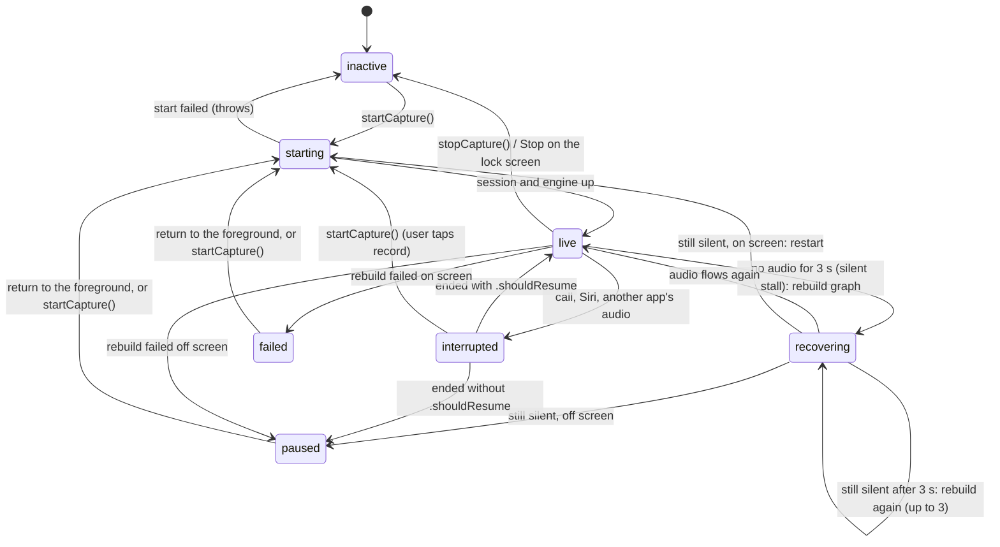

# Long sessions in the background

Issue #26 (epic #3). A Blau conversation must keep working for an hour or
more with the screen locked: capture, transcription and Grok's replies all
continue, and nothing stalls silently when the app moves between the
foreground and the background. This document covers what keeps the process
running, what watches it, how on-device models cope with the iOS 27 Neural
Engine restrictions, the lock-screen indicator, and how to verify it all on
a device.

| Piece | Where | What it does |
| ----- | ----- | ------------ |
| `audio` background mode | `project.yml` (`UIBackgroundModes`) | An active `.playAndRecord` session with a running engine keeps Blau running off screen |
| `AudioSessionKeeper` | `BlauAudio/Background` | The app's `AudioService`: starts and stops the conversation's audio, never stops it for backgrounding, watches for silent stalls, resumes on return what couldn't resume off screen, drives the indicator, counts everything |
| `ConversationAudio` | `BlauAudio/Background` | Capture (#24) and playback (#25) on one `AudioSessionController` (#23), with a keeper in charge. `AppEnvironment.live()` builds it |
| `InferenceBackendSwitchable`, `InferenceObserver` | `BlauCore/Inference` | The seams every on-device model stage adopts: switch backend, report each inference |
| `BackgroundInferencePolicy`, `BackgroundInferenceMonitor` | `BlauTranscription/Background` | Decides and performs backend switches (Neural Engine → CPU → `SpeechTranscriber`) off screen, and back on return |
| `RecordingIndicator` | `BlauAudio/Background` | The protocol for the lock-screen indicator |
| `LiveActivityRecordingIndicator`, `RecordingActivityAttributes`, `StopConversationIntent` | `Blau/LiveActivity` | The indicator as a Live Activity, with a Stop button |
| `RecordingLiveActivity` | `BlauWidgets/` (app extension) | Renders it on the lock screen and in the Dynamic Island |
| `DeviceLockObserver` | `Blau/Composition` | Tells the keeper and the monitor when the device locks (protected data unavailable) |
| `LongSessionReport` | `BlauTranscription/Background` | The soak run's report and its pass/fail rules |
| Long session soak screen | `Blau/Debug/LongSession` | Debug menu → **Long session soak test** |

## What keeps Blau running

iOS keeps an app with the `audio` background mode running while its audio
session is active and doing audio. Blau's session is `.playAndRecord` /
`.voiceChat` with voice processing (docs/audio.md), active and recording for
the whole conversation, so locking the screen changes nothing for the
process: the engine keeps delivering 20 ms buffers, the capture thread keeps
converting them, and every consumer keeps running. No
`beginBackgroundTask`, `BGTaskScheduler` or `BGContinuedProcessingTask` is
involved, and none would help: background tasks are time-limited, and
continued processing is a user-initiated job with system progress UI
(docs/benchmarks.md).

The keeper's rules follow from that:

1. **Never stop audio because Blau left the screen.** `appPhaseDidChange`
   only records the phase. Stopping the engine off screen would deactivate
   the session and iOS would suspend the app within seconds.
2. **Never deactivate the session to recover off screen.** iOS refuses to
   start recording from the background (`AVAudioSession` activation fails
   with `cannotStartRecording`), so recovery off screen rebuilds the graph
   on the still-active session (`AudioSessionController.recoverFromStall()`).
3. **Leave what needs a fresh start for the foreground.** When the session
   is lost off screen (a failed rebuild, an interruption that ended without
   `.shouldResume`, a stall that rebuilding didn't fix), the keeper marks
   the conversation `paused`, the indicator says "Open Blau to resume", and
   the next return to the foreground restarts it from scratch.

### Keeper states



A call still in progress when the user opens Blau is left alone: on
returning to the foreground the keeper only restarts after an interruption
has *ended* (the controller's `isAwaitingManualResume`), so it never fights
the phone app for the mic.

iOS doesn't guarantee an interruption-ended notification, though: when
another app's non-mixable audio takes the session, none may ever arrive. So
an explicit `startCapture()` (the user tapping record) while `interrupted`
restarts from scratch. If a call really still holds the mic, activation
fails and the status becomes `failed`, which the UI shows and the user can
retry; the conversation never sits `interrupted` with no way out.

### The silent-stall watchdog

No notification reports an engine that stops delivering audio while
claiming to run (a wedged I/O unit, a media-server hiccup that doesn't
reset). Every second (`watchdogInterval`) the keeper checks that the
capture hub's sample offset moved. Three seconds without audio while the
controller says `running` is a stall: it emits `audio.captureStall`, logs a
fault and rebuilds the graph, up to `maximumStallRecoveries` (3) times,
three seconds apart. Interruptions and the time before the engine is up
never count. `Statistics.longestSilentCaptureSeconds` records the longest
silence seen; on a healthy run it is 0.

The watchdog's clock keeps counting while the device sleeps
(`ContinuousClock`), so if iOS ever did suspend Blau, the first check after
resuming sees the gap, reports it and recovers.

## Neural Engine restrictions (iOS 27)

The research brief in #1 said iOS 27 restricts background Neural Engine
access behind a `continued-processing.inference` entitlement. The spike
(#22, docs/benchmarks.md) found that **no such entitlement exists** in the
iOS 27.2 SDK, and that Core ML has no background-specific API or error. What
iOS actually does to a backgrounded app's Neural Engine work can only be
measured on an iPhone, with the background probe, and that measurement is
still pending. So #26 implements the decision table from the spike as a
runtime policy that works whatever the verdict turns out to be:

- **Shipping mitigation.** `BackgroundInferenceMitigation.shipping` is
  `.keepNeuralEngine` until the probe reports: stay on the Neural Engine
  off screen and watch. When the verdict lands, change that one line to what
  `BackgroundInferenceMitigation.recommended(for:hop:)` returns, and every
  stage then starts off screen where the mitigation says
  (`backgroundBackend(ladder:)`):

  | Mitigation | ASR (`[neuralEngine, cpu, systemSpeech]`) | VAD, voice ID (`[neuralEngine, cpu]`) |
  | --- | --- | --- |
  | `keepNeuralEngine`, `acceptCPUFallback`, `fixBackgroundExecution`, `rerunProbe` | Neural Engine | Neural Engine |
  | `reloadOnCPUWhenBackgrounded` | CPU | CPU |
  | `switchToSystemTranscriber` | `SpeechTranscriber` | CPU (no system equivalent) |

- **Runtime escalation.** Off screen, the monitor watches every inference a
  stage reports. Two errors in a row (`errorLimit`), or a p95 latency over
  80% of the stage's budget (the same share as the probe's verdict) across
  at least 20 recent inferences (`minimumSamples`, out of a 40-inference
  window), moves the stage one step down its ladder. A backend that fails
  to load is skipped. A stage with nowhere left to go is *exhausted*: it
  stays put and the monitor logs a fault once. `isExhausted` clears when
  Blau comes back on screen, but `exhaustedOffScreen` keeps counting for the
  life of the registration, so the soak report still sees it after the
  user unlocks.
- **Back on screen** every stage returns to the Neural Engine, and the
  furthest backend each one needed is remembered: the next trip off screen
  starts there instead of failing its way down again.
- **Inactive changes nothing.** Pulling down Control Center or the app
  switcher (`inactive`) never reloads a model; only `background` does.
- **The `minimal` performance level** (#75: critically hot or almost out
  of battery, see [performance.md](performance.md#thermal-and-power-adaptation))
  holds every stage that offers `systemSpeech` (streaming ASR, once #31
  adds it) on Apple's `SpeechTranscriber`, on screen or off. Other stages
  are left alone: moving the VAD to the CPU would only add heat. When the
  level improves, stages go back to where the phase puts them, and a trip
  off screen spent on `SpeechTranscriber` only because of the level isn't
  learned. The app feeds the level in with
  `BackgroundInferenceMonitor.follow(performance.performanceLevels())`.

A switch loads the replacement model while the current one keeps serving
requests, then swaps, so a stage never misses a chunk. Stages adopt
`InferenceBackendSwitchable`:

| Stage | Adopts | Budget | Status |
| ----- | ------ | ------ | ------ |
| Silero VAD (`SileroSpeechProbabilityModel`) | `[neuralEngine, cpu]`, keeps its LSTM state across a switch | 256 ms chunk | Done (#26); the segmenter reports each model call through `inferenceObserver` |
| Streaming ASR (`TranscriberRouter`: Parakeet EOU, then Apple's `SpeechTranscriber`) | `[neuralEngine, systemSpeech]` (Parakeet on the CPU needs `.cpuOnly` loading in `ParakeetEouRecognizer`) | 320 ms hop | Done (#31): the router is the `"asr"` stage, switches engines at an utterance boundary, and `ParakeetStreamingTranscriber` reports each chunk through `inferenceObserver` ([apple-asr.md](apple-asr.md)); the composition root registers it with the live audio pipeline |
| Voice ID (WeSpeaker) | `[neuralEngine, cpu]` | per segment | #47 registers the gate's embedder |

Every model is loaded with `.cpuAndNeuralEngine` or `.cpuOnly`, never with
the GPU, which iOS refuses in the background (docs/benchmarks.md).

### Telemetry

Logs: `Log.audio` for the keeper (status changes, phases, stalls, a summary
of the conversation when it ends), `Log.asr` for the monitor (every change of
a stage's backend with the reason, every switch with its duration, faults
for exhausted stages), `Log.ui` for the Live Activity and device lock.

```sh
log stream --level debug --predicate 'subsystem == "com.joeblau.blau" && (category == "audio" || category == "asr")'
```

Signposts (lifecycle markers, not canonical pipeline intervals):

| Name | Category | Kind | When |
| ---- | -------- | ---- | ---- |
| `audio.captureStall` | `audio` | event | The keeper asked the controller to rebuild after a silent stall |
| `inference.backendSwitch` | `asr` | interval | One stage switching backend (model load included) |

## The lock-screen indicator

While a conversation is on, Blau shows a Live Activity on the lock screen
and in the Dynamic Island: a microphone (red while listening), the status
("Blau is listening", "Reconnecting the microphone", "Paused for a call",
"Paused. Open Blau to resume"), a timer since the conversation started, and
a **Stop** button. iOS shows its own microphone indicator too; the Live
Activity says why the microphone is on and lets the user turn it off
without unlocking (privacy and control).

- The keeper drives it through `RecordingIndicator`: `show` when the
  conversation starts (Blau is in the foreground then, which
  `Activity.request` requires) and on every status change, `hide` when it
  ends. Updates run one at a time, in order, and always show the current
  status.
- **Stop** is `StopConversationIntent`, a `LiveActivityIntent`: it runs in
  Blau's process (which is running, since it is recording) and calls
  `AppEnvironment.stopConversation()`.
- An activity left behind by a run that was killed mid-conversation would
  claim Blau is listening. The app ends any recording activity at launch,
  and before starting a new one.
- If the user has turned Live Activities off for Blau, nothing is shown and
  the conversation is unaffected.
- The `BlauWidgets` extension renders the activity. It doesn't link BlauKit;
  it shares `Blau/LiveActivity/RecordingActivityAttributes.swift` with the
  app (see `project.yml`).

## Tests

| Where | What | Runs |
| ----- | ---- | ---- |
| `BlauAudioTests/Background/AudioSessionKeeperTests.swift` | A **simulated 30-minute locked session** (live throughout, no re-activation or restart, time split by phase); silent stalls rebuilt without deactivating; a stall that won't clear pausing off screen and restarting on return (or restarting at once on screen); interruptions with and without `.shouldResume`; a call still in progress left alone; failed rebuilds off and on screen; start failures; stop; the watchdog timer; the indicator mapping. Also `recoverFromStall`, `isAwaitingManualResume` and `ConversationAudio` | `swift test` on the Mac |
| `BlauTranscriptionTests/Background/BackgroundInferencePolicyTests.swift` | The mitigation table, phases, errors and latency off screen, warm-up, failed switches, learning across trips | `swift test` on the Mac |
| `BlauTranscriptionTests/Background/BackgroundInferenceMonitorTests.swift` | Switches performed and recorded, failures falling through, quick bounces, lock refinement, snapshots; **the VAD surviving a Neural Engine that throws once the device locks** (moved to the CPU after two errors, back on return) | `swift test` on the Mac |
| `BlauTranscriptionTests/Background/PerformanceLevelInferenceTests.swift` | The `minimal` level moving only `systemSpeech`-capable stages, on and off screen, recovery, no learning, failed moves; the monitor following a level stream | `swift test` on the Mac |
| `BlauTranscriptionTests/Background/LongSessionReportTests.swift` | The soak report's rules (including heat without degrading, #75) and JSON | `swift test` on the Mac |
| `BlauTranscriptionTests/VAD/SileroLiveTests.swift`, `switchingBackendsMidStreamKeepsTheResults` | The real Silero model switching Neural Engine → CPU → Neural Engine mid-fixture: identical probabilities, boundaries within tolerance | `BLAU_VAD_MODEL_DIR=<installed sileroVAD dir> swift test --filter SileroLiveTests` |
| `BlauTests/LongSessionTests.swift` | The built app declares `audio` and Live Activities and embeds the extension; the activity mirrors the indicator; Stop ends the conversation; scene phases reach the monitor | `make test-unit` (simulator) |
| `BlauTests/LongSessionTests.swift`, `ConversationAudioLiveTests` | The live keeper on the real voice-processing engine: audio flows, no stall | `BLAU_DEVICE_TESTS=1`, microphone permission |

## Manual verification on a device

Locking the screen, phone calls and the iOS 27 Neural Engine behaviour
can't be simulated. Use a DEBUG build on an iPhone with a passcode,
**Debug menu → Long session soak test**, with the Silero VAD installed (the
speech-model setup card) so a Core ML model runs the whole time. Until
streaming ASR (#29) and the turn orchestrator (#36) land, the VAD stands in
for "transcribes", and "responds" can only be checked once they exist.

Watch the logs with the `log stream` command above. **Stop and report**
writes a `LongSessionReport` (JSON, shareable) and a pass/fail verdict:
locked at least 30 minutes, every stall recovered, live at least 99% of the
time unless a call interrupted, the VAD analysed at least 95% of the audio,
and no model stage exhausted at any point off screen (`exhaustedOffScreen`,
read before the VAD stage is unregistered, so unlocking before stopping
doesn't hide it).

| # | Scenario | Steps | Expected | Result |
| - | -------- | ----- | -------- | ------ |
| B1 | 30-minute locked session (iOS 27) | Start, talk for a minute, lock, leave 30+ min talking now and then, unlock, stop | Report passes; the Live Activity showed "Blau is listening" and its timer throughout; VAD segments for the speech while locked | Pending |
| B2 | Same on iOS 26 | As B1 | As B1 | Pending |
| B3 | Neural Engine off screen | During B1, check the **Background inference** section and the `asr` log | Either no switch (the Neural Engine kept working), or `vad` moved to `cpu` with the reason, and back to `neuralEngine` on unlock. Record which in the probe results table (docs/benchmarks.md) | Pending |
| B4 | Foreground ↔ background bounces | Start, then 20 times: Home, wait 5 s, back to Blau; also lock/unlock 10 times | Status `live` the whole time; no stall faults; `Not live` ≈ 0 s; no crash | Pending |
| B5 | Call while locked | Locked session, call the phone, answer, talk, hang up | Live Activity shows "Paused for a call", then "Blau is listening" again within ~1 s of hanging up, without unlocking | Pending |
| B6 | Declined / missed call while locked | As B5 but decline | Either no interruption or back to listening | Pending |
| B7 | Interruption without resume | Locked session; play music in another app from Control Center | While the music plays, the Live Activity shows "Paused for a call" (status `interrupted`). If the music stops with an interruption-ended without `.shouldResume`, it shows "Paused. Open Blau to resume" and opening Blau resumes. If no interruption-ended arrives, opening Blau leaves it `interrupted`, and tapping record takes the session back (`live`) | Pending |
| B8 | Stop from the lock screen | Locked session; tap **Stop** on the Live Activity | The activity disappears; the orange microphone indicator goes away; the soak screen shows `inactive` when unlocked | Pending |
| B9 | AirPods while locked | Locked session; take AirPods out and back in | Route follows; capture continues (no `Capture dropped` beyond the rebuild) | Pending |
| B10 | Killed mid-session | Start, then kill Blau from the app switcher; relaunch | The stale Live Activity is gone after relaunch | Pending |
| B11 | Live Activities off | Settings → Blau → Live Activities off; start | No activity, conversation works, a `Live Activities are off` log | Pending |
| B12 | One hour | As B1 for 60+ minutes, plugged in and on battery | Report passes (including the #75 rule: no time hot at the `normal` level); note the report's worst thermal state, time at or below `fair` and battery drain | Pending |
