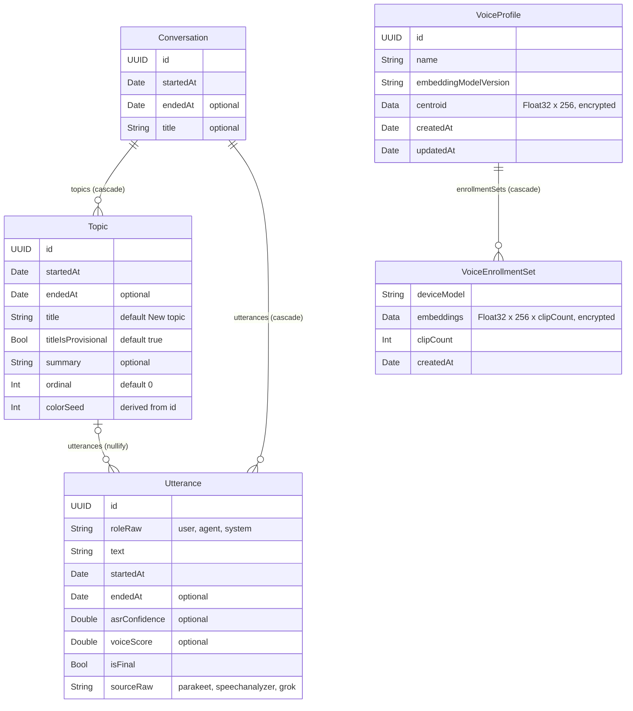

# Data model

Blau keeps all text (conversations, topics, utterances) and the user's
voiceprint in SwiftData. The store is mirrored to the user's private CloudKit
database in `iCloud.com.joeblau.blau`, so it follows CloudKit's schema rules.
Derived data such as embeddings and search indexes stays local and is
rebuilt from these models (issue #7).

The models live in `Packages/BlauKit/Sources/BlauPersistence/Schema`.

## Schema v1

`SchemaV1` (version `1.0.0`) defines five flat models. Code outside
BlauPersistence uses the aliases in `CurrentSchema.swift`, which always point
at the newest version:

| Model (CloudKit record type)  | Swift alias          |
| ----------------------------- | -------------------- |
| `Conversation`                | `Conversation`       |
| `Topic`                       | `Topic`              |
| `Utterance`                   | `StoredUtterance`    |
| `VoiceProfile`                | `VoiceProfile`       |
| `VoiceEnrollmentSet`          | `VoiceEnrollmentSet` |

The persisted utterance's Swift alias is `StoredUtterance` because
`BlauCore.Utterance` is the pipeline's value type, and an unqualified
`Utterance` would be ambiguous in any file that imports both modules.
`StoredUtterance(_:source:conversation:topic:asrConfidence:voiceScore:)`
converts one into the other and keeps its `id`. The entity and CloudKit
record type are still named `Utterance`.

Every to-one side of a relationship (`Topic.conversation`,
`Utterance.conversation`, `Utterance.topic`, `VoiceEnrollmentSet.profile`) is
optional and uses `.nullify`.

### Delete rules

| Deleting            | Does                                                                 |
| ------------------- | -------------------------------------------------------------------- |
| a `Conversation`    | deletes its topics and utterances                                    |
| a `Topic`           | keeps its utterances; they stay in the conversation with no topic    |
| a `StoredUtterance` | removes it from its conversation and topic                           |
| a `VoiceProfile`    | deletes its enrollment sets                                          |

### Field notes

- **Identity.** Every model has `id: UUID = UUID()` (except
  `VoiceEnrollmentSet`, which is only reached through its profile). It is not
  `.unique` because CloudKit can't enforce uniqueness. UUIDs are random, so a
  duplicate only appears if the same logical record is created twice (for
  example on two devices); code that needs uniqueness de-duplicates on read.
- **Enums as strings.** `roleRaw` and `sourceRaw` store `UtteranceRole` and
  `TranscriptSource` raw values. Read them through `role` and `source`, which
  return `nil` for a value written by a newer app version instead of failing.
- **Ordering.** CloudKit doesn't support ordered relationships, so
  relationship arrays come back in no particular order. Use
  `Conversation.orderedTopics` (by `ordinal`, then `startedAt`) and
  `orderedUtterances` (by `startedAt`), or a `FetchDescriptor` with a sort.
- **Topic color.** `colorSeed` defaults to the first two bytes of `id`, so a
  topic has the same accent color on every device.
- **Voiceprint.** The voiceprint syncs through CloudKit (product decision 2 in
  issue #1), so enrolling once works on every device. Vectors are packed as
  little-endian Float32 with `PackedFloat32` (256 values per WeSpeaker
  embedding) and marked `.allowsCloudEncryption`, which stores them in
  CloudKit's end-to-end encrypted fields. Encryption can't be turned on or off
  for a field once the schema is in production, which is why it is decided
  in v1. If the user's iCloud Keychain is reset, the encrypted vectors are
  unreadable and the user re-enrolls.
- **Timestamps.** Initializers take every date explicitly; callers get them
  from `BlauClock` (see docs/architecture.md, rule 5). The `Date.distantPast`
  declaration defaults exist only to satisfy CloudKit.

## CloudKit rules

CloudKit mirroring rejects a schema that breaks any of these rules, but
SwiftData only reports it when a CloudKit-backed container loads, which needs
an iCloud account and entitlements. `CloudKitCompatibility.violations(in:)`
runs the same checks on the Core Data model SwiftData generates, and
`CloudKitCompatibilityTests` fails if any schema in `BlauMigrationPlan` breaks
one:

| Rule                                                        | Violation kind               |
| ----------------------------------------------------------- | ---------------------------- |
| Every attribute is optional or has a default value          | `attributeWithoutDefault`    |
| No `@Attribute(.unique)` and no `#Unique`                   | `uniquenessConstraint`       |
| Every relationship is optional                              | `requiredRelationship`       |
| Every relationship has an inverse                           | `relationshipWithoutInverse` |
| No `.deny` delete rule                                      | `denyDeleteRule`             |
| No ordered relationships                                    | `orderedRelationship`        |
| No `@Model` inheritance (CloudKit cast crashes on iOS 26.x) | `inheritance`                |

Each inverse is declared once, on the to-many side, with
`@Relationship(inverse:)`. SwiftData links the other side, and the Core Data
check confirms both ends have an inverse.

## Writing from the pipeline: `ConversationStore`

The live pipeline writes through one actor, `ConversationStore`
(`Sources/BlauPersistence/ConversationStore.swift`). The UI reads with
`@Query` on the main context and never writes pipeline data itself.

| Call                                      | Does                                                                                         | Saves                 |
| ----------------------------------------- | -------------------------------------------------------------------------------------------- | --------------------- |
| `startConversation(id:at:title:)`         | Inserts a conversation, or reopens an existing one with that id (relaunch); ends any other active one | at once               |
| `appendPartial(utteranceID:text:)`        | Keeps the latest streaming ASR hypothesis **in memory only**                                 | never                 |
| `discardPartial(utteranceID:)`            | Forgets a partial (for example speech the voice ID gate rejected)                            | never                 |
| `commitUtterance(_:source:asrConfidence:voiceScore:)` | Stores a final `BlauCore.Utterance` in its conversation and the topic covering its `startedAt` (the open topic, or for a late commit the topic current then, including the last topic of a conversation that has ended); re-committing the same id (second pass) updates it, even after the conversation ended or the app relaunched; blank text is skipped | batched |
| `openTopic(at:title:)`                    | Opens the next topic; closes the previous one at `at` and moves its utterances from `at` on, plus topicless ones (before the first topic or after `closeTopic`) from `at` on | batched |
| `closeTopic(_:title:summary:at:)`         | Closes a topic with the labeler's final title (non-provisional) and summary                  | batched               |
| `retitle(_:to:isProvisional:)`            | Renames a topic (provisional guess or manual edit)                                           | batched               |
| `endConversation(_:at:)`                  | Closes the open topic and the conversation, drops partials                                   | at once               |
| `flush()`                                 | Saves whatever is waiting. Call it when the app goes to the background                       | at once               |

**Partials are never persisted.** Only committed utterances are, always with
`isFinal == true`.

**No duplicate utterances.** CloudKit forbids `.unique`, so the store
de-duplicates by utterance id itself. For the active conversation it keeps
every utterance in memory (seeded once from the stored rows when a
conversation is resumed), so commits there need no fetch. A commit to any
other conversation, such as the second ASR pass for the last utterance
landing after the user taps stop, fetches the id (`fetchLimit` 1, including
unsaved inserts) and updates that row instead of inserting.

**Batched saves.** Every save is a SQLite transaction and, with CloudKit on,
an export, so `ConversationStoreSavePolicy.coalesced` (the default) saves a
change at most 2 s after it was made, or at once when 500 changes are
waiting. `.immediate` saves every change; it exists for comparison and is
several times slower per utterance (see docs/performance.md). Each save is a
`db.save` signpost interval and is counted in `statistics`.

**Never on the main thread.** The issue sketched `@ModelActor actor
ConversationStore`, but the macro's `DefaultSerialModelExecutor` runs a job
on whichever thread enqueues it. Measured with the iOS 27 / macOS 27 SDKs:
every call into such an actor from `@MainActor` code runs, and saves, on the
main thread. `ConversationStore` therefore conforms to `ModelActor` by hand
and uses `DispatchQueueModelExecutor`, which runs every job on a private
serial queue (at the calling task's priority, never below `.utility`) and
creates its `ModelContext` there with autosave off. Each save also checks
the thread: a main-thread save is counted in
`statistics.mainThreadSaveCount`, logged as a fault and stops a debug build
at an assertion. Use `DispatchQueueModelExecutor` for any other model actor
(the memory indexer, for example).

**Cost grows with conversation size.** Linking an utterance to its
conversation makes SwiftData update the inverse to-many
(`Conversation.utterances`), which costs more as the conversation grows.
A 2-hour session (1,000 to 2,000 utterances) is cheap; one 10,000-utterance
conversation is roughly twice as expensive per utterance as ten of 1,000.

## Versioning and migration

`BlauMigrationPlan` lists every shipped schema, oldest first, and has existed
since v1 so the first migration is just a new entry.
`BlauModelContainer.make(configurations:)`, `makeLocal(url:)` and
`makeInMemory()` always open stores with the current schema and the plan.
The app opens the CloudKit-backed store through `PersistenceController`; see
[sync.md](sync.md) for the sync modes and [release.md](release.md) for
deploying a schema to production.

Once a schema version is deployed to the CloudKit production environment, the
CloudKit schema is **additive only**: you can add record types and fields, but
never rename, retype or delete them. To change the model:

1. Copy the models into a new `SchemaV2` with `versionIdentifier` `2.0.0`.
   Never edit a version that has shipped.
2. Make only additive changes (new models, new optional or defaulted
   properties, new optional relationships with inverses).
3. Append `SchemaV2.self` to `BlauMigrationPlan.schemas` and add a
   `.lightweight(fromVersion: SchemaV1.self, toVersion: SchemaV2.self)` stage.
4. Point `CurrentSchema` at `SchemaV2`.
5. Run `swift test` in `Packages/BlauKit`: the CloudKit compatibility tests
   check every version in the plan.
6. Deploy the new schema to production in the CloudKit console before
   shipping the build (checklist in [release.md](release.md)).

The memory models (Document, CollectionItem, Entity, Fact, ProfileBlock) arrive
in v2 (#61).
