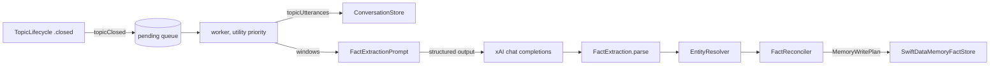

# Fact and entity extraction

After each topic closes, Blau reads what was said and turns it into durable
memory: the people, companies, places and projects the user talks about
(`MemoryEntity`) and dated statements about them and the user (`Fact`)
(#66, epic #9). The design follows Mem0 (add-only extraction with the model
deciding what a new fact replaces) and Zep / Graphiti (facts with validity
intervals); see issue #1. The code is in
`Packages/BlauKit/Sources/BlauMemory/Extraction/`; the app wiring is
`Blau/Memory/MemoryLearning.swift`.

```swift
let pipeline = FactExtractionPipeline(
    generator: XAITextGenerator(client: xai.client),            // xAI text API, Keychain key (#33)
    transcripts: DeferredTopicTranscriptSource { try await transcript.conversationStore() },
    store: DeferredMemoryFactStore { @MainActor in persistence.stack?.container },
    embedder: { try? await textEmbeddings.textEmbedder(for: .document) },
    isEnabled: { preference.load() },                            // Settings → Knowledge
    pending: UserDefaultsPendingFactExtractionStore(),
    gate: IndexingGate(performance: performance))                // thermal and power policy (#75)

for await event in topicLifecycle.events() {
    if case .closed(let topic) = event { await pipeline.topicClosed(topic.id) }
}
```

## Flow



| Step | Type | What it does |
| --- | --- | --- |
| Queue | `FactExtractionPipeline` | `topicClosed(_:)` records the topic in a persistent queue and returns; a worker task at utility priority drains it in order |
| Read | `TopicTranscriptSource` | The topic's utterances from `ConversationStore`, the transcript's single writer, so committed but unsaved utterances are included |
| Prompt | `FactExtractionPrompt` | Numbered transcript lines, the known entities the window mentions, current facts about them and the user (as `F1`, `F2`...), the conversation date |
| Generate | `TextGenerator` | `XAITextGenerator` (`grok-4.20-0309-non-reasoning`, temperature 0, strict JSON schema) |
| Parse | `FactExtraction` | Lenient parse and validation of `{entities, facts, summary}` |
| Resolve | `EntityResolver` | Alias match, then embedding similarity, else a new entity |
| Reconcile | `FactReconciler` | Add-only, validity-dated plan: new facts, invalidations, skips |
| Write | `SwiftDataMemoryFactStore` | One save per window, on a private queue (`DispatchQueueModelExecutor`) |

## The request

The reply schema is the issue's `{entities:[{name,type,aliases}], facts:[{subject,predicate,object,confidence}], summary}`
with three additions the pipeline needs:

| Field | Why |
| --- | --- |
| `entities[].summary` | A short description ("Co-founder of Y Combinator") for `MemoryEntity.summary` when it has none |
| `facts[].source` | The transcript line number, mapped back to the utterance for `Fact.sourceUtteranceID` (provenance) and `validFrom` |
| `facts[].replaces` | Handles of known facts the new one makes no longer true |

The schema is strict (every object closed, every property required), so
"none" is `""`, `0` or `[]`. Entity types are listed in the description
rather than as an `enum`; the parser maps anything unknown to `other`.
Structured output is a request, not a guarantee, so the parser takes the
JSON object anywhere in the reply, accepts numbers as strings, clamps
confidences, drops blank names, predicates and objects, caps a reply at 40
entities and 60 facts, and reads "user", "I", "me" and similar as the user.

The model is told to extract only what the user stated or confirmed (never
Blau's guesses), to skip small talk and passing moods, to resolve pronouns
and relative dates, and never to repeat a known fact that is still true.

A topic longer than `transcriptTokenBudget` (6,000 estimated tokens) is
split into windows, each its own request; lines keep their topic-wide
numbers, and each window is written before the next is read, so later
windows see what earlier ones learned. Windows without user speech are
not sent.

## Entity resolution

`EntityResolver`, per extracted entity and per fact subject the reply
didn't list:

1. **Alias match.** A known entity whose name or an alias equals the name,
   ignoring case, diacritics, width and whitespace; then one matching an
   extracted alias. If several known records match the name (the same
   entity created on two devices while offline), the oldest is kept and the
   others are merged into it: their facts move and their names become
   aliases. The duplicates are **kept, empty, never deleted**:
   `MemoryEntity.facts` cascades, so deleting one would, once synced, also
   delete the facts the other device added to its copy that this device
   hadn't seen yet, and a fact imported after its subject is gone would read
   as a fact about the user. Every device picks the same canonical record
   (oldest, then by id), so a fact that lands on a duplicate later is moved
   by the next merge. A duplicate with no facts is set aside before matching
   (`EntityResolver.settingAsideEmptyDuplicates`, its names folded into the
   record it duplicates), so it isn't merged again on every extraction or
   listed twice in the prompt.
2. **Embedding similarity.** Otherwise the name is embedded with the shared
   text embedding service (#60) and compared with known entities of a
   compatible type (the 500 most recent); the best cosine similarity at or
   above **0.86** wins and the new name becomes an alias. Vectors of known
   names are cached per model version. While the embedding model isn't
   installed, or if it fails, only alias matching runs.
3. **Create** a new entity.

Types are compatible when equal or when either is `other`, so "Apple" the
company never absorbs "apple" the concept. A name repeated within a reply
resolves to the same new entity.

## Add-only, validity-dated facts

`FactReconciler` turns the reply into a `MemoryWritePlan`. Nothing is ever
deleted by extraction, neither facts nor entities (an entity delete would
cascade to its facts); only the user deletes facts.

| Case | Result |
| --- | --- |
| New fact | Inserted, `origin` `extracted`, `validFrom` = its source utterance's `startedAt` (the window's start without a usable source), `sourceUtteranceID` = that utterance |
| `replaces` a known fact about the same subject | The old fact gets `invalidatedAt` = the new fact's `validFrom`; the new fact is current. "Where did I work in March" still finds the old one |
| The replaced fact is newer than the statement (an older conversation extracted late) | The new fact is stored as already superseded (`invalidatedAt` = the known fact's `validFrom`); the known fact stays current |
| The replaced fact has origin `user` (or an origin this version doesn't know) | The new fact is dropped: the user's word outranks a model's inference |
| Same subject, predicate and object as a current fact (case, spacing and trailing punctuation ignored) | Dropped as a repeat, also when it arrived meanwhile from another device |
| Confidence below 0.5 | Dropped |
| `replaces` names a fact about another subject, or an unknown handle | That replacement is ignored |

Invalidation uses `Fact.invalidate(at:)`, which keeps the earlier date, so
replaying a correction (a retried window, a second device) converges.

## When it runs

- **Every closed topic.** The app subscribes to the topic lifecycle's
  events and queues every `.closed` topic: each confirmed boundary closes
  one, and finishing the conversation closes the last. A topic is queued
  once, and one already extracted this launch isn't queued again.
- **Never on the UI's time.** `topicClosed(_:)` only appends to the queue
  and returns; the worker runs at utility priority, the store writes on its
  own serial queue, and the request goes over the network. The pipeline test
  `queuingReturnsAtOnceWhileTheModelIsStillAnswering` holds the model's
  reply open and checks that queuing has already returned.
- **Durable queue.** The queue is kept in `UserDefaults`
  (`blau.memory.pendingFactExtractions`) so a topic that closed just before
  the app was suspended, killed, offline or without a key is extracted
  later. The app resumes the queue at launch and whenever it becomes active.
- **Thermal and power.** The worker waits on `IndexingGate` before each
  topic: at once at `normal`, deferred up to 5 minutes at `reduced`,
  suspended at `minimal` (docs/performance.md).
- **Failures.** No xAI key: the queue waits for the next resume. xAI errors
  that need the user (invalid key, no credits) also wait; network, rate
  limit and server errors and unusable replies are retried after 30 s,
  2 min, 8 min... (capped at 30 min), and a topic is dropped after 4
  attempts. A topic that no longer exists, or a request xAI rejects as
  malformed, is dropped. A retried topic re-runs every window; repeats are
  skipped.

Each topic is a `memory.extract` signpost interval (Instruments only; the
end message is the number of facts added and invalidated) and is logged
under `Log.memory` with counts only. Observers get `events()`: queued,
started, finished (with the `FactExtractionOutcome`, including the model's
summary for the profile consolidation, #67), failed, waiting for the text
model, and discarded.

## Privacy

- **Settings → Knowledge → Learn From Conversations** (on by default). Off,
  closed topics aren't queued, the waiting ones are dropped at once, and
  nothing more is sent; what was learned stays until the user deletes it.
  The preference is per device (`blau.memory.learnsFromConversations`).
- Extraction sends the topic's transcript, plus the names and facts memory
  already holds that the transcript mentions, to xAI with the user's own
  key, directly from the device (no backend, #33). The conversation itself
  already went to xAI.
- **Settings → Knowledge → What Blau Learned** lists every fact, current ones
  first and the ones that stopped being true under "No Longer True", with
  swipe to delete (every CloudKit copy). The full knowledge-base screens are
  #65; this list is the minimum the issue's privacy note asks for.
- Logs never contain transcript or fact text.

## Testing

`swift test` in `Packages/BlauKit` (hermetic: a scripted text model, an
in-memory SwiftData store, a table embedder):

| Suite | Covers |
| --- | --- |
| `FactExtractionParsingTests` | The reply schema, lenient parsing, caps |
| `FactExtractionPromptTests` | Rendering, fact handles, the strict schema, windows, mention detection |
| `EntityResolverTests` | Alias match, similarity threshold, type compatibility, duplicate merges, embedder failure |
| `FactReconcilerTests` | Invalidation, user-fact precedence, late statements, repeats, provenance |
| `SwiftDataMemoryFactStoreTests` | Writes, CloudKit copies, merges, delete |
| `FactExtractionPipelineTests` | The contradiction test (old fact invalidated, new one active), non-blocking queueing, every topic in order, windows, privacy toggle, missing key, retries and backoff, a durable queue, the thermal gate |

`BlauTests/MemoryLearningAppTests` (app-hosted) checks the wiring: a topic
the lifecycle closes is learned from, the toggle drops the queue, deleting
a fact, the xAI error mapping, and that preview and test environments never
call a text model.

Not covered here: extraction quality on real conversations with the real
model. That needs an xAI key and belongs to the memory evaluation harness
(#70).
