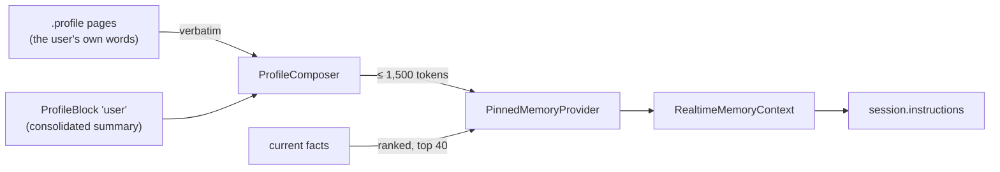

# The pinned profile and sleep-time consolidation

Every realtime session starts with what Blau knows about the user: a short
profile and the most important current facts, in the instructions'
"About the user" and "What you remember" sections (#35). The profile is
kept up to date by **sleep-time consolidation** (#67, epic #9): about once
a week, while the phone charges, a background task asks the text model to
rewrite it from everything memory knows now. This is Letta's pinned memory
block with sleep-time rewriting, fed by the add-only facts of #66 (see
issue #1).

The code is in `Packages/BlauKit/Sources/BlauMemory/Profile/`; the app
wiring is `Blau/Memory/ProfileMemory.swift`,
`ProfileConsolidationBackgroundTask.swift` and `ProfileView.swift`.

```swift
let pinned = PinnedMemoryProvider(store: DeferredProfileMemoryStore { persistence.stack?.container })
let realtime = RealtimeSessionServices.make(memory: ProfileMemory.realtimeContext(pinned))

let consolidator = ProfileConsolidator(
    generator: XAITextGenerator(client: xai.client),           // the user's key (#33)
    store: DeferredProfileMemoryStore { persistence.stack?.container },
    topicSummaries: DeferredTopicSummaryWriter { try await transcript.conversationStore() },
    log: FileProfileConsolidationLogStore.applicationSupport(),
    notes: UserDefaultsProfileConsolidationNoteStore(),
    isEnabled: { preference.load() },                           // Learn From Conversations
    gate: IndexingGate(performance: performance))               // thermal and power policy (#75)
```

## What is pinned



| Part | Source | Rewritten by consolidation |
| --- | --- | --- |
| The user's own words | `Document`s of kind `.profile` (the knowledge base, #65), title and body | **Never.** Pinned verbatim under "In the user's own words:" |
| The summary | `ProfileBlock` with key `user` | Yes, from facts, notes and recent topics |
| Facts | Current `Fact`s, ranked: told by the user first, then about the user, then confidence, then newest | No; they are the input |

The user's words are composed with the block when a session reads them
(`ProfileComposer.pinnedProfile`), not copied into it, so an edit reaches
the next session at once and no model ever paraphrases it. Facts the user
told Blau directly (origin `user`, e.g. through `remember`, #68) are marked
"told by the user" in the consolidation prompt and outrank everything else.

`PinnedMemoryProvider` caches the answer for five minutes, since the
session configurator asks for it on every `session.update`; the app drops
the cache whenever an extraction adds or invalidates facts and after each
consolidation.

## The token budget

`ProfileBlock.tokenBudget` is **1,500 tokens**, estimated as UTF-8 bytes / 4
(`ProfileBlock.approximateTokenCount`), so a profile is within budget
exactly when it has at most 6,000 bytes. `ProfileComposer` guarantees it
for the pinned profile as a whole, whatever the user wrote and whatever the
model returned:

1. The user's words get up to 60% of the budget while there is a summary
   too (all of it otherwise). Longer text is cut, still verbatim, at the
   last paragraph, sentence or word boundary that fits and marked "…"; the
   whole page stays searchable through `search_memory` (#68).
2. The summary gets the rest. The model is told it as a word limit
   (bytes / 7, deliberately low), and its reply is cut to the byte budget
   at the last line break, else sentence end, else space, so an overlong
   reply loses whole thoughts from the end.

`RealtimeInstructions.Limits.maximumProfileCharacters` is 6,000, so the
instructions never cut a budgeted profile.

## Consolidation

`ProfileConsolidator.consolidate(reason:)`:

1. **Read** (one `SwiftDataProfileMemoryStore`, off the main thread): the
   block, the `.profile` pages (copies of a page resolve to the most
   recently edited), up to 200 current facts in ranked order (CloudKit
   copies of a fact are one fact and the earliest invalidation wins, so a
   fact with any invalidated copy is not current), the
   closed topics of the last 30 days (up to 30), and the notes fact
   extraction left (the model's per-topic summary of what the conversation
   says about the user, `FactExtractionOutcome.summary`, kept per device in
   `UserDefaults` until a consolidation uses them).
2. **Ask** the text model (`grok-4.20-0309-non-reasoning`, temperature 0,
   strict JSON schema `{profile, topics:[{topic, summary}]}`) to rewrite the
   summary in labeled plain paragraphs (Work:, Projects:, People:, Goals:,
   Preferences:...), following the current facts over the old profile,
   dropping what nothing supports any more, never repeating the user's own
   words, and inventing nothing. Invalidated facts are never shown, so a
   contradiction resolved by extraction (#66) disappears from the profile
   at the next run.
3. **Fit** the reply to the budget (above). Markdown is stripped. An empty
   profile while facts exist is treated as a broken reply, never as a wipe.
4. **Write** the block in one save, only if it is still the text that was
   read (`writeProfileBlock(expectedText:)`): when another device's
   consolidation synced in meanwhile, the run stops with
   `.skipped(.conflict)` and the next one starts from that version.
   Duplicate `user` blocks (two devices offline) are merged into the latest
   one; a block has no relationships, so deleting a copy loses nothing.
5. **Topic summaries.** The recent topics are shown with handles (`T1`,
   `T2`...) and the model may return a better one-sentence summary for a
   topic whose summary is missing or that memory makes clearer (full names
   instead of pronouns). A new summary is written through
   `ConversationStore.replaceTopicSummary(_:expected:with:)`, the
   transcript's single writer, only for a topic of an **ended**
   conversation (the lifecycle and offline re-segmentation, #55, may still
   revise the others) and only while its summary is still the one the
   model saw. Titles are never touched. A practice run's topic (#69,
   `PracticeRunTopic`) is never rewritten: its summary is the run's record
   of scores and notes, which nothing else keeps.
6. **Log** the change (`ProfileConsolidationRecord`: before, after, the
   topic summary changes, what the model saw) in this device's log,
   `Application Support/Memory/profile-consolidations.json` (newest 30,
   file protection until first unlock so the background task can write it
   while the phone is locked). A run that changed nothing only updates
   `lastRunAt`. A run that didn't finish (failed, or skipped for any reason
   other than Learn From Conversations being off) records `lastAttemptAt`
   and counts `failedAttempts`, which start the retry backoff below.

Concurrent calls share one run. Each run is a `memory.consolidate`
signpost interval (Instruments only) and is logged under `Log.memory` with
counts only, never profile text.

## When it runs

| Rule | Value (`ProfileConsolidationSchedule`) |
| --- | --- |
| First run | As soon as memory has what a run reads: a current fact or a closed topic of the last 30 days |
| Weekly | 7 days after the last consolidation, if any fact was added or invalidated or a note is waiting |
| Sooner | After 20 changes since the last one: facts added or invalidated, plus extraction notes waiting and facts the user removed |
| Removed facts | As soon as the spacing below allows, after the user deleted a fact or had Blau forget one |
| Never more often than | Every 12 hours |
| After a run that didn't finish | Not before 1 hour, doubling with each further one up to 24 hours; a run that finishes resets it |

The backoff keeps a bad key, a broken reply, a missing key or the thermal
gate from turning into a request (or a background task resubmitted for
"now") on every launch and every app activation.

**Removed facts.** Deleting a fact in Settings → Memory → What Blau
Learned hard-deletes its records, which leaves nothing for
`factChangeCount(since:)` to count, and the `forget` tool (#68) only
invalidates one, which alone would wait for the weekly run. Either way the
summary could keep saying what the user asked Blau to forget. So both paths
report the removal (`ProfileFactRemovals`: `LearnedFactsView` after a
delete, `RemovalReportingMemoryToolBackend` around the tools' backend after
a confirmed `forget`), which:

- drops the `PinnedMemoryProvider` cache, so the next `session.update` no
  longer lists the fact;
- counts it in the log's `pendingRemovals`
  (`ProfileConsolidator.noteRemovedFacts(count:)`), which makes a run due on
  its own (`.removedFacts`) once the 12-hour spacing and any retry backoff
  allow. The run tells the model how many facts were removed (the count
  only; their text is gone) and to drop what the current facts no longer
  support. A run that finishes clears the removals it read memory after;
  one noted while it runs waits for the next. With no summary and nothing
  in memory, a pending removal is dropped, since nothing pins it.

The count is per device. A fact deleted on another device is consolidated
there, and the block syncs.

"The last consolidation" is the later of this device's last run and the
block's `updatedAt`, so a profile another device just rewrote (it syncs
through iCloud) isn't rewritten here too.

- **Background task.** `com.joeblau.blau.memory-profile`, a
  `BGProcessingTaskRequest` with `requiresNetworkConnectivity` and
  `requiresExternalPower`, submitted every time the app leaves the
  foreground with `earliestBeginDate` = the next check
  (`ProfileConsolidator.nextBackgroundCheck()`: now if due, the retry time
  during a backoff), and again after each run. Nothing is submitted while
  Learn From Conversations is off. iOS runs it while the phone is idle and charging. The
  identifier is in `BGTaskSchedulerPermittedIdentifiers` (`project.yml`).
  On expiration the run is cancelled; nothing is written half way.
- **Foreground catch-up.** A phone that is rarely left charging may never
  get the task. When the app becomes active (and no conversation is
  running), a first run, a run due because the user removed a fact, or a
  consolidation that is due and more than three days past its weekly date,
  runs at utility priority. It respects
  the retry backoff, so a failing run is repeated at most once per
  backoff period, not on every activation.
- **Update Now** in Settings → Memory → Profile runs one at once.
- **Gates.** Nothing runs while Learn From Conversations is off (turning it
  off also drops the waiting notes), without an xAI key, or before the
  thermal and power gate allows it (#75).

## The diff view

Settings → Memory → **Profile** shows the summary Blau pins, the user's
own words, the token meter (pinned tokens of 1,500), Update Now with the
last outcome, and **Changes**: every consolidation on this device. A
change opens a word-level diff (`ProfileDiff`, Myers via
`CollectionDifference`): added words green and underlined, removed words
red and struck through (readable without color; VoiceOver reads "added:" and
"removed:"), the rewritten topic summaries the same way, and what the run
was based on.

The log is per device: the block syncs, the history of how this device
changed it doesn't.

## Privacy

Consolidation sends the current facts, the extraction notes, the recent
topic titles and summaries, the current profile and the user's own profile
pages to xAI with the user's key, directly from the device (no backend,
#33). It runs only while Learn From Conversations is on, the same switch
that governs extraction. Logs never contain profile or fact text.

## Testing

`swift test` in `Packages/BlauKit` (hermetic: a scripted text model, an
in-memory SwiftData store, a manual clock):

| Suite | Covers |
| --- | --- |
| `ProfileComposerTests` | **The budget** for any user text and any reply (multi-byte included), verbatim user words, boundary cuts |
| `ProfileConsolidatorTests` | **Budget with an overlong reply**, the logged diff, user facts first, invalidated facts hidden, notes used once, topic summaries only for ended conversations and only while unchanged, never a practice run's record (#69), the cross-device conflict, duplicate blocks, empty replies, model errors, the toggle and missing key, scheduling, the retry backoff after failures and skips, old topics alone not making a run due, no background check while learning is off, notes replaced mid-run, the log's backward-compatible decoding, one shared run, the signpost |
| `ProfileConsolidationPromptTests` | Rendering, the removed-fact count, the strict schema, lenient parsing and Markdown cleanup |
| `ProfileConsolidationScheduleTests` | First run, weekly, fact threshold, a removal due on its own, minimum spacing, the retry backoff |
| `ProfileFactRemovalTests` | **A deleted fact**: due after the spacing and taken out of the summary, the pinned cache dropped on delete, the `forget` tool reporting a removal, a removal mid-run waiting for the next, a failed run keeping it, nothing pinned dropping it |
| `ProfileDiffTests` | Word runs, whitespace, reconstruction |
| `PinnedMemoryProviderTests` | Composition, fact ranking and limit, the cache |
| `SwiftDataProfileMemoryStoreTests` | Reads, CloudKit copies (a fact with an invalidated copy is not current, nor pinned), page copies, compare-and-set writes, change counts, `hasMemory` within the topic window |
| `ConversationStoreTopicEditTests` | `replaceTopicSummary` compare-and-set |
| `RealtimeInstructionsTests.defaultLimitKeepsAWholeBudgetedProfile` | The instructions never cut a 6,000-byte profile |

`BlauTests/ProfileMemoryAppTests` (app-hosted) checks the wiring end to
end: a closed topic's extraction leaves a note, consolidation uses it, and
the profile and facts appear in the session's instructions; a deleted
fact leaves the pinned facts at once and the summary through the
foreground catch-up; fake environments never call a text model.

Not covered here: consolidation quality with the real model and the
background task actually being launched by iOS. Both need a device and an
xAI key. On a device, force the task from the debugger with
`e -l objc -- (void)[[BGTaskScheduler sharedScheduler] _simulateLaunchForTaskWithIdentifier:@"com.joeblau.blau.memory-profile"]`
after backgrounding the app.
