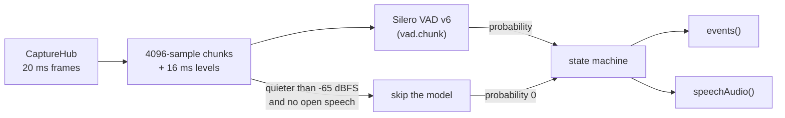

# Voice activity detection

`VoiceActivitySegmenter` (in `BlauTranscription/VAD`) finds where speech
starts and ends in the captured audio, so ASR, voice ID and turn-taking work
on clean segments and do nothing in silence (#28). It runs Silero VAD v6
through FluidAudio on the 16 kHz capture stream ([audio.md](audio.md#capture-24))
and reports segments as absolute sample ranges into the capture history.

```swift
import BlauAudio
import BlauTranscription

guard let directory = modelManager.directory(for: .sileroVAD) else { return }   // docs/models.md
let model = try await SileroSpeechProbabilityModel(modelDirectory: directory)
let vad = VoiceActivitySegmenter(model: model)
Task { await vad.run(on: capture.hub) }        // until capture finishes or the task is cancelled

for await event in vad.events() {
    switch event {
    case .speechStarted(let onset):            // confirmed speech: barge-in (#37), voice ID look-back (#47)
        let firstSecond = capture.hub.audio(from: onset, to: onset.startOffset + 16_000)
    case .speechEnded(let segment):            // SpeechSegment: sampleRange, endReason, latency
        let audio = capture.hub.audio(for: segment)   // sample-accurate, while in the 30 s history
    }
}

// A consumer that should compute only while someone speaks:
for await item in vad.speechAudio() {
    switch item {
    case .started(let onset): ...              // begin
    case .audio(let frame): ...                // contiguous speech audio, from the onset on
    case .ended(let segment): ...              // end
    }
}
```

`SpeechSegment`, `SpeechOnset`, `VoiceActivityEvent`, `SpeechAudioEvent` and
the `VoiceActivitySource` protocol live in `BlauCore`, so `BlauVoiceID` (a
sibling of `BlauTranscription`) consumes segments without importing it; the
composition root passes the segmenter in as a `VoiceActivitySource`.

## Pipeline



1. Frames from the hub are cut into the model's 4096-sample (256 ms) chunks,
   and each chunk's level is measured in 16 subframes of 16 ms.
2. Silero scores the chunk; its LSTM state carries over from chunk to chunk
   (`SileroSpeechProbabilityModel`).
3. `SpeechSegmentationStateMachine` turns probabilities and levels into
   segments.

## Rules

| Setting | Default | Meaning |
| --- | --- | --- |
| `threshold` | 0.5 | A chunk at or above it starts speech (or keeps it up) |
| `negativeThreshold` | threshold − 0.15 | Once speech is open, only a chunk below it is silence; chunks in between don't change the state (Silero's hysteresis) |
| `minimumSpeechDuration` | 250 ms | Speech is confirmed (`speechStarted`) once its voiced span reaches this; shorter bursts are dropped |
| `minimumSilenceDuration` | 300 ms | Hangover: the segment ends when the silence after the last voiced audio reaches this |
| `maximumSegmentDuration` | 8 s | Longer speech is split; the next segment has `isContinuation` |
| `splitSearchWindow` | 1 s | A split falls mid-way through the quietest 16 ms of the last second before the limit, so it lands between words |
| `speechPadding` | 30 ms | Added on both sides; never over the previous segment |
| `onsetLookback` | 512 ms | How far before the triggering chunk the onset may move |
| `energyMarginDecibels` | 6 dB | A subframe this far above the noise floor counts as voiced |
| `modelSkipLevelDecibels` | -65 dBFS | Below this, with no speech open, the model isn't run |

The threshold is Silero's upstream default. FluidAudio's `VadConfig` defaults
to 0.85; on the fixtures Silero v6's probabilities are close to 0 or 1, and
0.5 finds every utterance with no false starts (see Results).

### Boundaries to 16 ms

Silero scores 256 ms chunks, which alone would put boundaries up to a
quarter of a second off. The state machine refines each one from the
signal's energy:

- **Onset:** the first voiced subframe of the chunk that triggered, extended
  backwards (up to `onsetLookback`, never before the previous segment) while
  the energy stays up, bridging gaps of up to 80 ms. Speech that began in
  the chunk before, while the model was still unsure, is included.
- **End:** the last voiced subframe of the last speech chunk, extended into
  the following chunks only while it is contiguous. Silero's probability
  stays high for a chunk or so after the words, so a single high-probability
  chunk with no energy doesn't move the end. Two or more in a row are speech
  too quiet to refine (a distant speaker in a noisy room): they count whole,
  the first one included, and also count towards the minimum speech
  duration. When the whole segment has had no energy above the floor, chunk
  edges are used throughout.
- **Noise floor:** the 20th percentile of the subframes of chunks the model
  calls silence, falling fast and rising at a quarter per chunk. Digital
  silence (filled gaps, muted input) is ignored.

Segments are then sample ranges on the capture stream's own offsets. A gap in
the input up to 1 s (capture dropped audio) is analysed as silence so offsets
stay aligned; a longer one closes an open segment with `.streamEnded` and
restarts after the gap. When that frame arrives while the model is still
working on a chunk (actor re-entrancy, for example a host feeding frames
from un-awaited tasks), the chunk in flight belongs to the stream before the
gap and is dropped; analysis carries on from the audio after the gap.

### Why not FluidAudio's streaming state machine

The issue suggested FluidAudio's `VadManager.makeStreamState()` /
`processStreamingChunk` events. Checked against the resolved FluidAudio
0.17.5 source (`VAD/VadManager+Streaming.swift`): its streaming state machine
has a threshold, hysteresis and a minimum silence, but **no minimum speech
duration and no maximum segment length** (those exist only in its offline
`segmentSpeech`), and its events sit on chunk boundaries. Blau calls
`processStreamingChunk` for the probability and the carried `VadStreamState`
(the model's per-chunk API, `processChunk`, is internal), ignores the event,
and runs its own state machine.

## Power: nothing runs in silence that doesn't have to

- **Model skipping.** While nobody speaks, a chunk quieter than
  `modelSkipLevelDecibels` (RMS) is silence without a model call. Voice
  processing's noise suppression often brings a quiet room below that. The
  model state is reset before the next call. `statistics.chunksSkipped`
  counts them.
- **Speech-gated audio.** `speechAudio()` delivers audio only between
  `started` and `ended`, so a consumer of it computes nothing in silence.
  Each segment's audio starts at its onset (the backlog up to the decision
  comes as one frame), then follows capture frame by frame; the hangover is
  delivered before `ended`. Streaming ASR (#29) gates itself on `events()`
  instead: its end-of-utterance detector has to hear the silence after the
  speech, so it keeps reading the capture stream until the utterance is
  committed, then stops ([asr.md](asr.md)).
- **Cost when the model does run:** one call per 256 ms. On the Mac, a minute
  of room tone (model on every chunk, 235 calls) costs **0.2–0.3% of one core**
  of process CPU in total (`SileroLiveTests.silenceCostsUnderThreePercent`);
  the segmenter's own work is a fraction of that
  (`VoiceActivitySegmenterTests.ownOverheadInSilenceIsFarBelowThreePercent`).
  The model runs on the Neural Engine with CPU fallback (the compute units
  `ModelManager` warmed it up for); wall time per call varies with Neural
  Engine load and isn't CPU.

## Telemetry

| What | Where |
| --- | --- |
| `vad.chunk` interval | One per model call (`Signposts.asr`; canonical, see [performance.md](performance.md)) |
| Segment ended | `Log.asr` info: id, sample range, duration, end reason (no audio, no text) |
| Speech started | `Log.asr` debug: offset, segment id, detection latency in samples |
| Input gaps, model failures | `Log.asr` notice / error (first failure, then every 100th in a row) |
| `statistics` | `VoiceActivityStatistics`: chunks analysed and skipped, model failures and time, segments, forced splits, rejected bursts, speech samples, gaps, dropped `speechAudio()` values |

`SpeechOnset.detectionLatency` and `SpeechSegment.endDetectionLatency` give
the decision delays for the latency budget (#74): about 0.25–0.5 s for an
onset (one or two chunks) and 0.3–0.55 s for an end (the hangover rounded up
to a chunk).

## Models

| Model | Use |
| --- | --- |
| `SileroSpeechProbabilityModel` | Production: Silero VAD v6 unified 256 ms (`.sileroVAD`, [models.md](models.md)), loaded from `ModelManager`'s directory, never with FluidAudio's downloading initialiser |
| `EnergySpeechProbabilityModel` | Model-free fallback (level above a tracked floor), for before the model is installed and for tests that must not load Core ML. It can't tell speech from other sounds |
| `SpeechProbabilityModel` | The protocol both implement; tests replay recorded probabilities through it |

## Tests

| Where | What | Runs |
| --- | --- | --- |
| `Tests/BlauTranscriptionTests/VAD/VADFixtureTests.swift` | **The ±100 ms criterion** on four labelled WAV fixtures with Silero's recorded probabilities replayed; the 8 s split (bounded, contiguous, between words); frame size independence; absolute offsets; reading segments back from a real `CaptureHub`; `speechAudio()` contiguity and silence gating; the energy fallback | `swift test` |
| `Tests/BlauTranscriptionTests/VAD/SpeechSegmentationStateMachineTests.swift` | Every rule on synthetic chunks: refinement, look-back, minimum speech, hangover, hysteresis, model smoothing, quiet speech, splits, stream end, noise floor | `swift test` |
| `Tests/BlauTranscriptionTests/VAD/VoiceActivitySegmenterTests.swift` | Model skipping and resets, model failures, input gaps (also arriving while the model runs), overlapping and wrong-rate frames, `finish`, `run(on:)`, `vad.chunk` signposts, model time, overhead in silence | `swift test` |
| `Tests/BlauTranscriptionTests/VAD/SileroLiveTests.swift` | The same fixtures through the **live Silero model**, and the CPU cost of a minute of room tone; `BLAU_VAD_RECORD=1` re-records the probabilities | Only with `BLAU_VAD_MODEL_DIR` (see the fixtures README) |

The fixtures, how they are generated and how to re-record them are described
in `Tests/BlauTranscriptionTests/Fixtures/VAD/README.md`.

### Results

Live Silero v6.2.1 on the Mac (`SileroLiveTests`), reported minus labelled,
start / end:

| Fixture | Errors (ms) | Worst |
| --- | --- | --- |
| `conversation-quiet` (5 utterances, -62 dBFS room) | -30/+38, -38/+44, -36/+22, -26/+32, -40/+40 | 44 ms |
| `conversation-noisy` (4 utterances, 18 dB SNR) | -26/-40, +20/-16, -4/+16, -12/-2 | 40 ms |
| `monologue-long` (13.4 s, split once at 8 s) | -38/+34 | 38 ms |
| `pauses` (200 ms pause kept, 700 ms pause split) | -34/+28, -28/+32 | 34 ms |

Most of the outward bias is the 30 ms padding.

## On a device

These need a physical iPhone and are recorded here when run.

| Check | How | Result |
| --- | --- | --- |
| CPU during silence < 3% | Release build, a session running in a quiet room for 2 minutes with nobody speaking. Instruments **Time Profiler** (or **CPU Profiler**) on Blau: CPU of the VAD's threads and the whole process while silent; `statistics.chunksSkipped` vs `chunksAnalyzed` | Pending |
| Boundaries on real speech | Speak 20 short and long utterances at arm's length on the speaker route and on AirPods; compare `Speech segment` log ranges with a waveform of the history audio | Pending |
| Background and screen locked (iOS 27 Neural Engine restriction, #26) | Lock the screen mid-session; segments keep arriving (Core ML falls back to the CPU); check CPU again | Pending |
| Noisy room | Café or street noise: no segments while nobody speaks, every utterance found | Pending |
