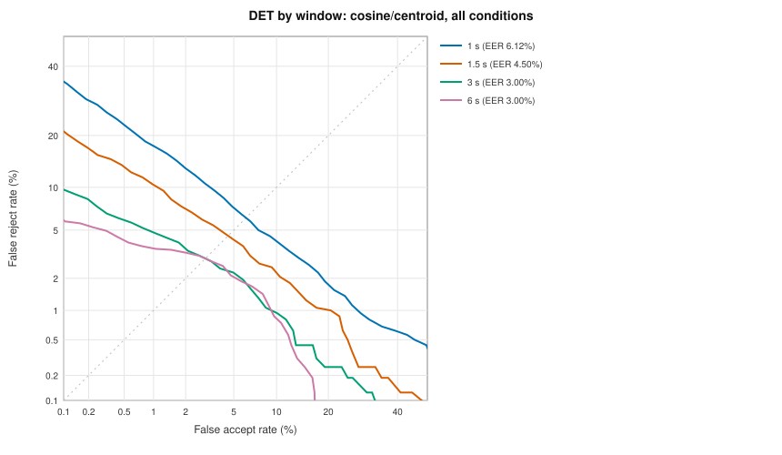
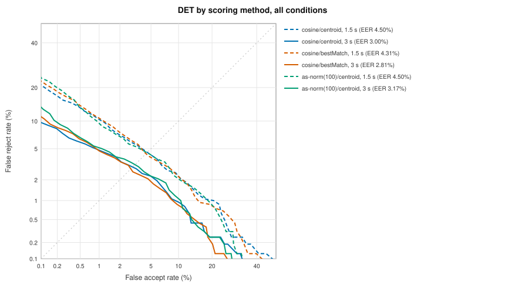
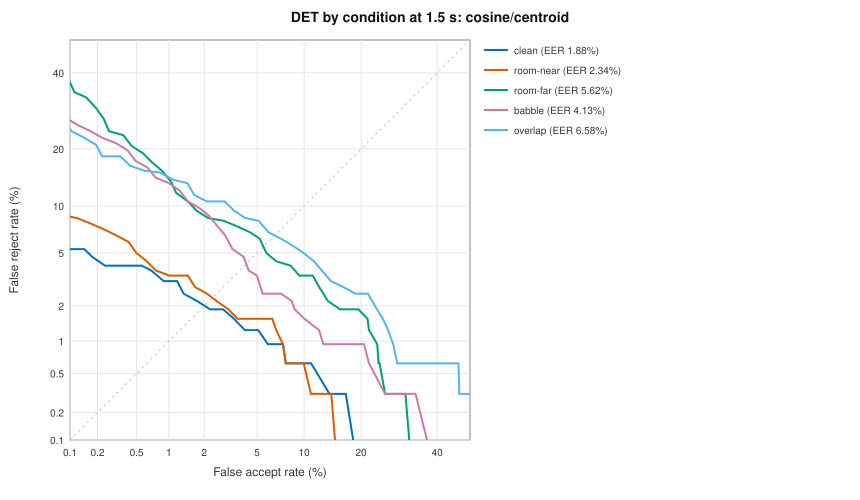
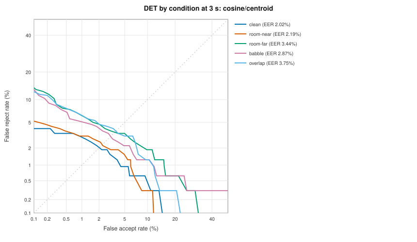
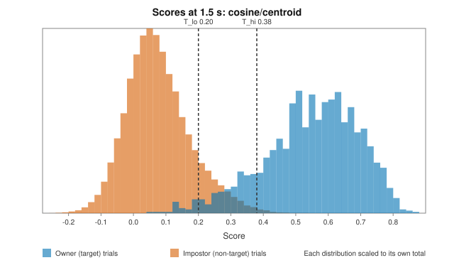
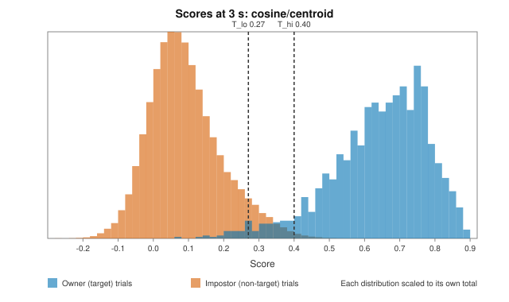

# Voice ID evaluation and threshold calibration

The verification gate (#47) accepts a speech segment when its score is at
or above `T_hi`, rejects it below `T_lo`, and is uncertain in between. This
document describes the harness that measures how well scores separate the
enrolled speaker from everyone and everything else, the results, and the
thresholds Blau ships with (#48). The embedding model itself is covered in
[voice-id.md](voice-id.md).

## Thresholds in use

`VoiceIDConfig.calibrated` (BlauVoiceID), raw cosine similarity against the
enrollment centroid, WeSpeaker ResNet34-LM (`wespeaker-resnet34-lm@df2625ac`):

```swift
short: VoiceIDThresholds(accept: 0.38, reject: 0.20),
long: VoiceIDThresholds(accept: 0.40, reject: 0.27),
```

| Window | Used for | `T_hi` (accept ≥) | `T_lo` (reject <) | FAR at `T_hi` | FRR at `T_lo` | Owner uncertain | Impostor uncertain |
| --- | --- | ---: | ---: | ---: | ---: | ---: | ---: |
| 1.5 s (`short`) | Embeddings of less than 3 s | 0.38 | 0.20 | 0.47% | 1.94% | 11.6% | 10.8% |
| 3 s (`long`) | Embeddings of 3 s or more | 0.40 | 0.27 | 0.50% | 1.88% | 4.00% | 5.59% |

Rates are on the calibration set below, every condition pooled (1,600 owner
and 74,880 impostor trials per window). `T_hi` is the lowest threshold with
a false accept rate (FAR) of at most **0.5%**, `T_lo` the highest with a
false reject rate (FRR) of at most **2%** (`VoiceIDCalibrationTargets.standard`),
both rounded outward to 0.01 so the shipped values err on the safe side.

```swift
let config = VoiceIDConfig.calibrated
let decision = config.decision(score: score, audioDuration: embedding.audioDuration)
```

**These are provisional.** They come from a public corpus with simulated
rooms, noise, loudspeakers and overlapping talkers, not from the owner's
own recordings. Re-calibrate on the owner set ([below](#the-owners-set))
before relying on them, and whenever the model, the scoring method or the
enrollment flow (#46) changes. `VoiceIDConfigTests.committedThresholdsAreDocumented`
fails if the config and the snippet above drift apart.

## Curves

DET curves (false reject against false accept rate, probit axes) for the
shipped scoring method at each window, every condition pooled:



The three scoring methods at the gate's two windows (1.5 s dashed, 3 s
solid):



Each condition at 1.5 s and 3 s:





Score distributions with the thresholds:





The full generated report, including every slice and the decision breakdown
by condition and session, is [voice-id-eval/report.md](voice-id-eval/report.md).

## Results (2026-10-07)

Calibration set: LibriSpeech dev-clean, 40 speakers, test-clean cohort (see
[Datasets](#datasets)). Mac host (Apple M3 Max, macOS 27.2), Core ML
`cpuAndNeuralEngine`.

### Equal error rate by window and scoring method

Every condition pooled.

| Scoring | 1 s | 1.5 s | 3 s | 6 s |
| --- | ---: | ---: | ---: | ---: |
| cosine/centroid (shipped) | 6.12% | 4.50% | 3.00% | 3.00% |
| cosine/bestMatch | 6.33% | 4.31% | 2.81% | 2.88% |
| as-norm(100)/centroid | 5.95% | 4.50% | 3.17% | 3.09% |

### Fixed operating points, cosine/centroid

| Window | EER | EER threshold | FAR @ FRR 1% | FAR @ FRR 3% | FRR @ FAR 1% | FRR @ FAR 0.5% |
| --- | ---: | ---: | ---: | ---: | ---: | ---: |
| 1 s | 6.12% | 0.23 | 26.3% | 13.2% | 17.6% | 22.9% |
| 1.5 s | 4.50% | 0.27 | 20.2% | 6.70% | 10.4% | 13.1% |
| 3 s | 3.00% | 0.32 | 9.25% | 2.92% | 4.75% | 5.88% |
| 6 s | 3.00% | 0.33 | 9.35% | 2.95% | 3.56% | 4.19% |

### By condition, cosine/centroid

EER:

| Condition | 1 s | 1.5 s | 3 s | 6 s |
| --- | ---: | ---: | ---: | ---: |
| clean | 2.64% | 1.88% | 2.02% | 2.19% |
| room-near | 3.00% | 2.34% | 2.19% | 2.50% |
| room-far | 8.12% | 5.62% | 3.44% | 3.86% |
| babble | 6.50% | 4.13% | 2.87% | 3.12% |
| loudspeaker | impostors only | | | |
| overlap | 8.12% | 6.58% | 3.75% | 3.12% |

Decisions at the shipped thresholds (accept / uncertain / reject):

| Condition | Owner at 1.5 s | Impostor at 1.5 s | Owner at 3 s | Impostor at 3 s |
| --- | --- | --- | --- | --- |
| all | 86.5 / 11.6 / 1.9% | 0.47 / 10.8 / 88.7% | 94.1 / 4.0 / 1.9% | 0.50 / 5.6 / 93.9% |
| clean | 96.2 / 3.4 / 0.3% | 0.64 / 12.1 / 87.3% | 96.6 / 2.8 / 0.6% | 0.59 / 6.3 / 93.2% |
| room-near | 95.6 / 4.1 / 0.3% | 0.58 / 11.6 / 87.8% | 96.6 / 2.8 / 0.6% | 0.54 / 5.9 / 93.5% |
| room-far | 76.9 / 19.7 / 3.4% | 0.35 / 9.6 / 90.0% | 92.2 / 4.7 / 3.1% | 0.42 / 4.9 / 94.7% |
| babble | 80.0 / 18.4 / 1.6% | 0.39 / 9.4 / 90.2% | 92.8 / 5.0 / 2.2% | 0.43 / 4.9 / 94.7% |
| loudspeaker | – | 0.39 / 10.9 / 88.7% | – | 0.45 / 5.5 / 94.1% |
| overlap | 83.8 / 12.2 / 4.1% | 0.49 / 11.2 / 88.3% | 92.5 / 4.7 / 2.8% | 0.54 / 6.1 / 93.3% |

### Findings

- **Duration matters up to 3 s, not beyond.** EER falls from 6.1% at 1 s to
  4.5% at 1.5 s and 3.0% at 3 s, then stays at 3.0% at 6 s. The gate's
  1.5 s first score and 3 s re-score (#47) are the right windows; waiting
  for 6 s buys nothing on this set.
- **The uncertain band does its job.** At 1.5 s, 11.6% of owner segments
  and 10.8% of impostor segments are uncertain and wait for the 3 s
  re-score, where the band shrinks to 4.0% and 5.6%. Fewer than 2% of owner
  segments are rejected at either window, and about 0.5% of impostor
  segments are accepted.
- **Distance is the hardest condition for the owner.** Far-field (2-3 m,
  reverberant) owner speech is uncertain 19.7% of the time at 1.5 s and
  rejected 3.1% of the time at 3 s, against 0.6% when close. Impostor
  accepts stay at or below 0.6% in every condition, including the
  simulated loudspeaker (TV, podcast).
- **AS-norm doesn't help here, so it isn't shipped.** With an 800-embedding
  cohort from the same corpus it ties raw cosine at 1.5 s (4.50%) and is
  slightly worse at 3 s (3.17% against 3.00%). It costs a bundled cohort and
  a cohort pass per score, and its scores aren't in cosine units. The
  harness keeps it so #47 can re-test it against the real owner set and a
  production cohort.
- **Best-match scoring** (the highest of the centroid and each enrollment
  clip) is marginally better at 3 s (2.81% against 3.00%) and marginally
  worse at 1 s. Not enough to switch; worth re-checking on the owner set.
- **Thresholds are lower than the 0.5-0.7 range** issue #1 expected. That
  range is for same-session, clean pairs (the #45 fixture set: same-speaker
  minimum 0.57 at 1.5 s). Here enrollment and probes come from different
  recording sessions and probes are degraded; owner scores spread down to
  about 0.2 at 1.5 s (see the histogram), and impostors rarely pass 0.35.

### The verification gate

The harness also replays the gate's decision (#47) on every trial
(`VoiceIDGateOutcome`, `VerificationGateRules.simulatedDecision`): each
probe is one speech segment, scored at every window it fills, and the
longest score (6 s here, standing in for the gate's end-of-segment score)
decides with the proposed thresholds for its length.

| Condition | Owner accept / uncertain / reject | Impostor accept / uncertain / reject |
| --- | --- | --- |
| all | 96.3 / 2.25 / **1.50%** | **0.71** / 6.80 / 92.5% |
| clean | 97.5 / 1.56 / 0.94% | 0.79 / 7.20 / 92.0% |
| room-near | 97.2 / 1.88 / 0.94% | 0.75 / 7.00 / 92.2% |
| room-far | 94.4 / 3.44 / 2.19% | 0.71 / 6.40 / 92.9% |
| babble | 95.9 / 2.19 / 1.88% | 0.57 / 6.29 / 93.1% |
| loudspeaker | – | 0.62 / 6.51 / 92.9% |
| overlap | 96.3 / 2.19 / 1.56% | 0.79 / 7.38 / 91.8% |

- **Owner FRR 1.50%** counting rejections, below the issue's 3%; 3.75% if
  uncertain owner speech is never sent (outside an active turn or under
  2 s). Far-field is the weak spot (2.19% rejected, 3.44% uncertain).
- **Impostor FAR 0.71%**: the long thresholds were calibrated at 3 s
  (0.50% there) and 6 s embeddings of impostors score a little higher.
  During an active turn the default uncertain policy also sends the 6.8%
  uncertain impostor segments of 2 s or more: the uncertain band costs
  more impostor leaks than it saves owner rejections on this set. The
  owner set should settle both the end-of-segment thresholds and the
  policy (`UncertainSpeechPolicy`).

### Limitations

- **Not the owner.** LibriSpeech is read English audiobook speech recorded
  by volunteers on home microphones. Rooms, distances, loudspeakers, babble
  and overlap are simulated (`VoiceIDCondition`), not recorded. Real TV,
  podcasts, music with vocals and other languages are not in this set; the
  simulated loudspeaker condition replays LibriSpeech impostors.
- **Small owner-side counts.** 1,600 owner trials per window means the 2%
  FRR rests on about 30 rejections: a rough estimate. The impostor side
  (74,880 trials, about 370 false accepts at `T_hi`) is solid.
- **Mac, not iPhone.** Scores come from Core ML on the Mac. The Neural
  Engine computes in lower precision; scores should agree to a few
  thousandths, but this is not measured yet.

## Pending results

| What | Status |
| --- | --- |
| Owner set: owner recordings across rooms and distances, other people, TV, podcasts, music with vocals, other languages, overlap ([Datasets/voice-id](../Datasets/voice-id/README.md)) | **Pending**: needs the recordings and consent. Re-run, then update the thresholds and this page |
| With and without DeepFilterNet3 on the verification path | **Done** (#51) on the calibration set: see [noise-suppression.md](noise-suppression.md#voice-id). `BLAU_VOICEID_EVAL_SUPPRESSORS` runs it again on the owner set |
| iPhone vs Mac score parity on the same audio | **Pending**: needs a device run |
| AS-norm with the production cohort (#47) | **Pending**: no gain on the public set, so the gate ships raw cosine without a bundled cohort; the harness takes any cohort recordings and the gate (`SpeakerVerifier(cohort:)`) any cohort, so re-test on the owner set |
| The gate's FRR / FAR on the owner set (#47) | **Pending**: needs the owner set. On the public set: owner FRR 1.50% (3.75% with uncertain dropped), impostor FAR 0.71% (7.5% with uncertain sent), see [The verification gate](#the-verification-gate) |

## History

One row per calibration run, so FAR/FRR can be tracked over time. The
full `report.json` of a run (about 1 MB, every slice and curve) is not
committed; keep it with the dataset and re-render it with
`VoiceIDEvaluationRenderTests` when needed.

| Date | Dataset | Model | Scoring | EER 1.5 s / 3 s | Short `T_hi` / `T_lo` | Long `T_hi` / `T_lo` | FAR / FRR at 3 s thresholds |
| --- | --- | --- | --- | --- | --- | --- | --- |
| 2026-10-07 | LibriSpeech dev-clean, 40 speakers, 6 conditions | `wespeaker-resnet34-lm@df2625ac` | cosine/centroid | 4.50% / 3.00% | 0.38 / 0.20 | 0.40 / 0.27 | 0.50% / 1.88% |
| 2026-10-08 | Same; re-run with the gate simulation (#47), identical thresholds and curves | `wespeaker-resnet34-lm@df2625ac` | cosine/centroid | 4.50% / 3.00% | 0.38 / 0.20 | 0.40 / 0.27 | 0.50% / 1.88%; gate: 0.71% / 1.50% |

## How the harness works

`VoiceIDEvaluator` (BlauVoiceID, `Sources/BlauVoiceID/Evaluation`) runs any
`SpeakerEmbedder` over an evaluation set described by a JSON manifest:

1. **Load.** `VoiceIDEvaluationDataset.load(manifest:)` reads every file
   with Core Audio (WAV, CAF, M4A, FLAC), averages channels, resamples to
   16 kHz and trims leading and trailing silence, as the VAD would. A
   manifest without a `consent` statement is refused; paths can't leave the
   manifest's directory; cohort speakers can't also be enrolled or probed.
2. **Enroll.** Each speaker with `enrollment` recordings is a target: up to
   5 clips, cut to 6 s, unprocessed (enrollment is guided, in a quiet room).
3. **Cohort.** `cohort` recordings (cut to 6 s) become the AS-norm cohort
   and the background talkers for the babble and overlap conditions.
4. **Probe.** Every `probe` recording, under every condition, is cut to the
   windows it fills (1, 1.5, 3 and 6 s from its start) and embedded.
   Conditions are seeded per probe (`EvaluationDSP.stableHash`), so a run is
   reproducible bit for bit.
5. **Score.** Every probe against every target's voiceprint with each
   scoring method: a target trial when the probe's speaker is the target,
   a non-target trial otherwise. Loudspeaker playback of the owner is not a
   target trial (Blau shouldn't answer a video of the owner), so that
   condition only measures false accepts.
6. **Measure.** `DETCurve` per preprocessor, scoring, window and condition
   (and pooled): EER (interpolated), FAR at fixed FRRs (1%, 3%), FRR at
   fixed FARs (1%, 0.5%), and a thinned curve for plotting.
7. **Calibrate.** `VoiceIDThresholdCalibrator` on the pooled scores of the
   calibration method at 1.5 s and 3 s; when the two budgets can both be met
   by one threshold, `T_lo` is lowered to `T_hi` (no uncertain band).
8. **Report.** `VoiceIDEvaluationReport` (Codable) with `markdown()`, and
   `VoiceIDEvaluationPlots` for the SVGs above. The decision breakdown
   splits trials by condition, probe `source` and manifest tags (`room`,
   `distance`, `language`, `session`).

| Type | Role |
| --- | --- |
| `VoiceIDConfig`, `VoiceIDThresholds` | The gate's tuning: scoring method, `T_hi` / `T_lo` per window, provenance |
| `VoiceIDScoring`, `VoiceprintScorer`, `SpeakerCohort` | Cosine against the centroid or best match, optional AS-norm; shared with the gate |
| `VoiceIDEvaluationDataset`, `VoiceIDDatasetManifest` | The evaluation set and its JSON manifest |
| `VoiceIDCondition`, `EvaluationDSP` | Simulated rooms, noise, babble, loudspeaker and overlap |
| `VoiceIDAudioPreprocessor`, `NoiseSuppressionPreprocessor` | A processing stage to compare: any `NoiseSuppressor` (#51, [noise-suppression.md](noise-suppression.md)) |
| `VoiceIDEvaluator`, `VoiceIDEvaluationPlan` | The run: windows, conditions, scoring methods, preprocessors, budgets |
| `DETCurve`, `VoiceIDThresholdCalibrator`, `Probit` | Metrics and calibration |
| `VoiceIDEvaluationReport`, `VoiceIDEvaluationPlots` | Markdown, JSON and SVG output |

### Simulated conditions

| Condition | What it simulates | Owner trials |
| --- | --- | --- |
| `clean` | The recording as is | yes |
| `room-near` | Small room, phone close (RT60 0.3 s, DRR +8 dB), room tone at 30 dB SNR | yes |
| `room-far` | Living room, phone 2-3 m away (RT60 0.6 s, DRR −3 dB), room tone at 15 dB SNR | yes |
| `babble` | Four cohort talkers at 10 dB SNR in a small room (RT60 0.4 s, DRR +3 dB) | yes |
| `loudspeaker` | A small speaker (200 Hz-5 kHz, saturated) across a living room: TV, podcast | no |
| `overlap` | A cohort talker 6 dB below the probe's talker | yes |

Rooms are synthetic impulse responses (a direct path plus an exponentially
decaying noise tail with the given RT60 and direct-to-reverberant ratio),
applied by FFT convolution and scaled back to the input level, as the
capture AGC would. Room tone is pink noise.

## Datasets

### Calibration set (public)

[LibriSpeech](https://www.openslr.org/12) (CC BY 4.0), built by
`scripts/voice-id-eval-librispeech.py`:

- **Targets and impostors:** the 40 dev-clean speakers (20 female, 20
  male). Each enrolls with 4 utterances (4-15 s, cut to 6 s) from one
  chapter and is probed with 8 utterances of at least 7 s from other
  chapters: a different recording session, like enrolling one day and
  talking the next. 11 speakers have a single chapter and are probed from
  the same session without reusing enrollment clips (`session` tag
  `mixed-session`; their FRR is lower, see the report).
- **Cohort and background talkers:** 20 utterances from each of the 40
  test-clean speakers (800 embeddings), disjoint from the targets.

No audio is committed; the script downloads about 700 MB and writes the
manifest next to the corpus.

### The owner's set

The real calibration set: the owner's recordings across rooms and mic
distances, plus impostors (other people, TV news, podcasts, music with
vocals, other languages) and overlap mixes, stored under Git LFS in
`Datasets/voice-id/` with everyone's consent. The recording protocol and
the manifest format are in [Datasets/voice-id/README.md](../Datasets/voice-id/README.md).
Not recorded yet.

## Running the harness

Hermetic tests (no model, no data) run with the rest of the package:

```sh
cd Packages/BlauKit
swift test --filter BlauVoiceIDTests
```

A calibration run needs the WeSpeaker model and a dataset. On the Mac:

```sh
# The model (once), see voice-id.md:
BLAU_MODEL_DOWNLOAD_SMOKE=1 BLAU_MODEL_DOWNLOAD_SMOKE_MODELS=speakerEmbedding \
  BLAU_MODEL_DOWNLOAD_SMOKE_DIR=/tmp/blau-models swift test --filter ModelDownloadSmokeTests

# The public calibration set (once):
scripts/voice-id-eval-librispeech.py --download ~/blau-eval

# The run (about 8 minutes on an M3 Max):
cd Packages/BlauKit
BLAU_SPEAKER_MODEL_DIR=/tmp/blau-models/speakerEmbedding/df2625ac79a7ac6b65ad868fee6d80f320da4232 \
BLAU_VOICEID_EVAL_MANIFEST=~/blau-eval/LibriSpeech/blau-voiceid-manifest.json \
BLAU_VOICEID_EVAL_OUTPUT=/tmp/blau-voiceid-eval \
  swift test --filter VoiceIDEvaluationRunTests
```

The output directory gets `report.md`, `report.json` and the SVG charts.
Copy the charts and `report.md` into `docs/voice-id-eval/`, the proposed
thresholds (printed, and in the report's Swift snippet) into
`VoiceIDConfig.calibrated` and the snippet at the top of this page, and add
a row to [History](#history). `BLAU_VOICEID_EVAL_CHECK_COMMITTED=1` makes
the run fail if the proposal differs from the committed config, to confirm
a re-run of the same set reproduces the shipped values.
`BLAU_VOICEID_EVAL_REPORT=<report.json>` with `--filter
VoiceIDEvaluationRenderTests` re-renders a stored run without the model.
