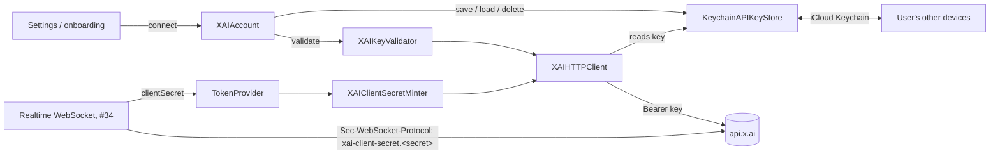

# xAI authentication

Blau has **no backend**. The user brings their own xAI API key; the app keeps
it in the iCloud Keychain and mints short-lived realtime tokens on device
(issue #33, and "Key decisions" in issue #1). The code lives in
`Packages/BlauKit/Sources/BlauRealtime/Auth/`; the app wires it up in
`Blau/XAI/XAIServices.swift`.



## The API key

`KeychainAPIKeyStore` stores one generic-password item
(service `com.joeblau.blau.xai`, account `api-key`) with:

| Attribute | Value | Why |
| --------- | ----- | --- |
| `kSecAttrSynchronizable` | `true` | iCloud Keychain syncs it to the user's other devices, so a key entered once works everywhere |
| `kSecAttrAccessible` | `kSecAttrAccessibleAfterFirstUnlock` | Readable with the screen locked, so long background sessions can mint new tokens. A `…ThisDeviceOnly` class would stop syncing |
| `kSecUseDataProtectionKeychain` | `true` | Required for synchronizable items on macOS; a no-op on iOS |

- The key is never stored in UserDefaults, SwiftData or files, and never
  logged. `XAIAPIKey` and `RealtimeClientSecret` redact themselves in
  `description`, `debugDescription` and `dump()`, and error messages from xAI
  are masked (`xai-…`) before they reach the UI or logs.
- REST calls go through an ephemeral `URLSession` (no cookies, credential
  store or URL cache), so neither the key nor minted secrets are written to
  disk by the URL loading system.
- "Remove key" in Settings deletes the item everywhere it synced.
- There is no Keychain change notification, so the app re-reads the item each
  time it becomes active to pick up a key added or removed on another device.

### Entering and validating a key

Settings → xAI account (`XAIAccountSettingsSection`) and the onboarding step
(`XAIKeyOnboardingStep`) share `XAIKeyEntryView` and the `XAIAccount` model.
A key is stored only after xAI accepts it, so a typo never replaces a working
key. `XAIKeyValidator` makes two cheap, unbilled calls:

1. `GET /v1/api-key`: wrong keys fail with 400/401, and the response's
   `api_key_blocked`, `api_key_disabled` and `team_blocked` flags catch keys
   that exist but are switched off. If the endpoint ever returns 404,
   `GET /v1/models` is used instead (the issue's suggestion).
2. `POST /v1/realtime/client_secrets`: proves the key may use the realtime
   voice API (an ACL-restricted key gets 403) and surfaces "no credits"
   errors where xAI reports them at mint time.

Every failure is shown next to the field, the typed key stays in place, and
editing it clears the error:

| Problem | Shown as | Key stored? |
| ------- | -------- | ----------- |
| Not key-shaped (spaces, too short, …) | "That doesn't look like an API key" | No, xAI isn't called |
| 400/401 | "xAI didn't accept this key" | No |
| Blocked / disabled key or team | "Key switched off" | No |
| No credits / spending limit (402, or a credit message on 400/403/429) | "No xAI credits" | No |
| 403 without realtime access | "Key can't use voice" | No |
| Offline, 429, 5xx | "Couldn't reach xAI", … | Only if the user taps **Save Without Checking** |
| Keychain locked / failing | "Unlock your iPhone" / "Keychain error" | No |

Problems the realtime layer hits later (credits running out mid-session) are
reported with `XAIAccount.report(_:)` and shown in Settings.

### DEBUG pre-fill

In DEBUG builds `XAI_DEV_API_KEY` from the gitignored `Config/Secrets.xcconfig`
reaches the app as `AppConfig.developmentAPIKey`
([configuration.md](configuration.md)). On first launch `DevelopmentKeySeeder`
copies it into the Keychain unless a key is already stored, then records a
flag (not the key) in UserDefaults so a key the developer later replaces or
removes stays that way. Release builds never carry the key.

## Realtime tokens

`TokenProvider` (an actor) hands the WebSocket client a
`RealtimeClientSecret`:

- **Minting.** `XAIClientSecretMinter` calls
  `POST https://api.x.ai/v1/realtime/client_secrets` with
  `Authorization: Bearer <key>` and `{"expires_after":{"seconds":600}}`.
  The response's `value` and `expires_at` (Unix seconds) are read from the
  top level, or from an OpenAI-style nested `client_secret` object.
- **No `session` in the mint request.** The issue's design notes put
  `"session":{"model":"grok-voice-think-fast-2.0"}` in the body, but xAI's
  ephemeral-token docs state the endpoint does not support `session` (or
  `expires_after.anchor`). The model is selected on the WebSocket URL
  (`AppConfig.xaiRealtimeURL`, `?model=…`) and with `session.update` (#35).
- **Caching and refresh.** A secret is reused until 60 s before it expires,
  so a caller always has at least a minute to open the socket. Expiry is
  tracked on the monotonic clock from when the request was *sent*; xAI's
  `expires_at` is only used when it reports a shorter lifetime (a wildly
  different value means the device clock is off and is ignored).
- **Single flight.** Concurrent callers share one mint.
- **Retry with backoff.** Network failures, 429 (honouring `Retry-After`) and
  5xx are retried 4 times in total, 1 s → 2 s → 4 s with ±20 % jitter. Key
  and account problems fail at once.
- **Grace period.** If a refresh fails while the current secret still has
  more than 5 s left, that secret is returned.
- **`invalidate()`** drops the cache and any mint in flight. `XAIAccount`
  calls it whenever the stored key changes; the WebSocket client should call
  it when the server rejects a secret.
- **`keepFresh()`** refreshes in the background for the length of a session
  so reconnects (#39) never wait for a mint; `prefetch()` warms the cache.

The WebSocket authenticates with the subprotocol
`xai-client-secret.<secret>` (`RealtimeClientSecret.webSocketSubprotocol`),
because `URLSessionWebSocketTask` strips the `Authorization` header from the
upgrade request. `RealtimeClient` asks for a secret on every connection and
calls `invalidate()` when an upgrade is refused with 401/403; see
[realtime.md](realtime.md).

If Blau ever ships on a shared xAI account, a minting proxy can implement
`RealtimeClientSecretMinting` without changing any caller.

## Other REST calls

`XAIHTTPClient` sends any REST request with the stored key. BlauTopics and
BlauMemory (topic-label fallback, fact extraction) sit in the same layer as
BlauRealtime, so they define their own protocols and the composition root
passes in implementations built on this client
([architecture.md](architecture.md), rule 2).

`XAITextGenerator` (`BlauRealtime/Text/`) is the first of those: it
implements BlauCore's `TextGenerator` with `POST /v1/chat/completions`
(model `grok-4.20-0309-non-reasoning`, a system and a user message,
`max_tokens`, `temperature` and optional `response_format` JSON-schema
structured output). BlauTopics uses it as the topic-label fallback when
Apple Intelligence is unavailable ([topics.md](topics.md#fallbacks)); the app
wires it in `Blau/Topics/TopicLabeling+App.swift`. `isAvailable()` only
checks that a key is stored, so a device without a key goes straight to
keyword labels.

## Testing

All of it is tested without a network or a real key:

- `swift test` in `Packages/BlauKit` covers key parsing and redaction, the
  Keychain queries (against a fake `KeychainServices`), error classification,
  the HTTP client, minting, validation, retry policy, the account model, and
  token refresh driven by `ManualClock`.
- `BlauTests/XAIServicesTests.swift` runs the app wiring with a stub
  transport, and a real Keychain round trip on the simulator. That suite
  needs a signed test host: with `CODE_SIGNING_ALLOWED=NO` every `SecItem`
  call fails with `errSecMissingEntitlement` (-34018), so it is skipped.
  Run it with ad-hoc signing:

  ```sh
  xcodebuild test -project Blau.xcodeproj -scheme Blau -testPlan Blau \
    -only-testing:BlauTests -destination 'id=<simulator udid>' \
    -derivedDataPath .build/DerivedData-signed \
    CODE_SIGNING_ALLOWED=YES CODE_SIGN_IDENTITY=- CODE_SIGN_STYLE=Manual DEVELOPMENT_TEAM=
  ```

- `BlauUITests/XAIKeyEntryUITests.swift` drives onboarding and Settings
  against DEBUG stubs selected by the `BLAU_UI_TEST_XAI` launch environment
  variable (`accept`, `reject`, `unfunded`, `offline`). With a stub active
  the app uses an in-memory key store, so UI tests never touch the Keychain.

### Manual verification

These need real devices and a real key, so they can't run in CI:

| Check | How | Result |
| ----- | --- | ------ |
| Key syncs across devices | Two devices on the same Apple Account with iCloud Keychain on, signed development build. Enter the key on device A; bring Blau to the foreground on device B: Settings → xAI account shows the same `•••• abcd` | pending |
| Removal syncs | Remove the key on device B; foreground Blau on device A: it shows "Not connected" | pending |
| Real validation | Enter a valid key, a revoked key, and a key from a team without credits; check the messages in the table above | pending |
| Locked-screen minting | Start a session, lock the phone for > 10 min, confirm tokens keep refreshing (Console: subsystem `com.joeblau.blau`, category `xai`) | pending (needs #34/#36) |
